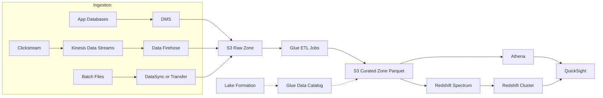

## What it is

A modern AWS analytics platform centers on an S3 data lake: raw data lands in S3, Glue catalogs and transforms it, Athena and Redshift query it, and QuickSight visualizes it. Streaming ingestion via Kinesis and Firehose sits alongside batch ingestion, and Lake Formation governs who can see what.

**Use it when** you need to combine data from many sources for BI and analytics, retain history cheaply, or serve both ad-hoc SQL and scheduled dashboards. **Be careful when** the real requirement is operational lookups — a data lake is not an OLTP database, and sub-second point queries belong in DynamoDB or RDS.

## Architecture

## Core components

| Component | Service | Role |
|---|---|---|
| Data lake storage | S3 | Cheap, durable zones: raw, curated, consumption; lifecycle to Glacier |
| Catalog | Glue Data Catalog | Central table and schema metadata shared by Athena, Redshift, EMR |
| ETL | Glue Jobs and Crawlers | Serverless Spark transforms; crawlers infer and update schemas |
| Streaming ingest | Kinesis Data Streams | Real-time, ordered event ingestion |
| Delivery | Amazon Data Firehose | Buffers, converts to Parquet, and lands streams in S3 with no code |
| Ad-hoc SQL | Athena | Serverless Presto queries directly against S3, priced per TB scanned |
| Warehouse | Redshift | High-concurrency BI warehouse; Spectrum queries S3 in place |
| Governance | Lake Formation | Table-, column-, and row-level permissions across the lake |
| BI | QuickSight | Dashboards with in-memory SPICE acceleration |
| CDC | DMS | Replicates operational databases into the lake |

## Design decisions and trade-offs

- **Batch vs streaming.** Batch (Glue on a schedule, Firehose micro-batches) is simpler and cheaper and satisfies most BI, where minutes of latency are fine. True streaming (Kinesis consumers, Managed Service for Apache Flink) is for real-time use cases — fraud detection, live dashboards — and costs more engineering. Start batch; add streaming only for the paths that prove they need it.
- **Athena vs Redshift.** Athena is zero-infrastructure and per-query pricing — ideal for ad-hoc exploration and low query volume. Redshift wins on concurrent BI workloads, complex joins at scale, and predictable latency, at the cost of running (or paying serverless RPU rates for) a warehouse. Many platforms use both: Athena on the lake, Redshift for the dashboard-serving layer.
- **File format matters more than engine.** Converting raw JSON/CSV to partitioned, compressed Parquet routinely cuts Athena scan cost and time by 10x or more. Partition by the columns you filter on, most commonly date.
- **Zones and immutability.** Keep raw data immutable and cheap — it is your ability to reprocess after a logic bug. Curated zones are derived and disposable.
- **Governance model.** IAM policies on buckets stop scaling once analysts need column-level control; Lake Formation centralizes grants at table, column, and row level and is the answer interviewers expect for fine-grained lake access.

## Well-Architected notes

- **Reliability** — S3 gives eleven nines durability; Firehose retries and can back up failed records to a separate prefix; Glue job bookmarks make reruns incremental and safe.
- **Security** — encryption with KMS everywhere; Lake Formation for fine-grained access; VPC endpoints so analytics traffic never crosses the public internet.
- **Performance efficiency** — columnar formats, partitioning, and compression are the big three levers; Redshift distribution and sort keys tune the warehouse.
- **Cost optimization** — S3 lifecycle policies tier cold data; Athena costs track data scanned, so Parquet plus partitions directly cut the bill; pause or use serverless Redshift for intermittent workloads.
- **Operational excellence** — everything defined as code; data quality checks with Glue Data Quality; monitor Firehose delivery failures and Glue job success.

## Common interview questions

- **Q: Athena queries are slow and expensive. First moves?** A: Convert to Parquet with Snappy compression, partition by the common filter columns, and make sure queries prune partitions — select only needed columns. This typically reduces scanned bytes by an order of magnitude.
- **Q: Data lake or data warehouse?** A: Not either/or — the lake (S3 + Glue + Athena) holds everything cheaply in open formats; the warehouse (Redshift) serves curated, high-concurrency BI. Redshift Spectrum bridges them by querying the lake from the warehouse.
- **Q: How do you get near-real-time data from an operational RDS database into the lake?** A: DMS change data capture streaming into S3 or Kinesis, then Firehose to the raw zone; Glue merges CDC deltas into curated tables, or use an open table format such as Iceberg for upserts.
- **Q: How do you restrict analysts to specific columns of a shared table?** A: Register the data with Lake Formation and grant column-level permissions there; Athena, Redshift Spectrum, and Glue all enforce those grants automatically.

## Related lab

Build this end to end in [Lab 5: Data Pipeline](../../labs/lab-05-data-pipeline).
