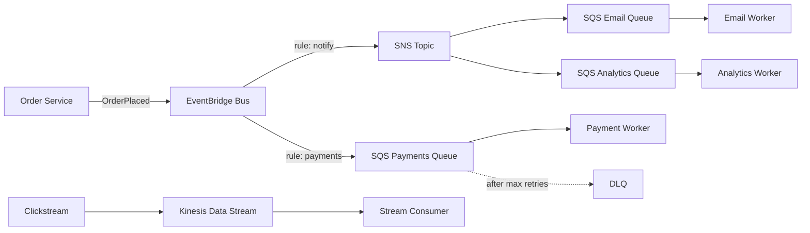

## What it is

Event-driven architecture decouples producers from consumers: services emit events describing facts that happened, and other services react asynchronously. On AWS the backbone is EventBridge for routed events, SNS for fan-out, SQS for buffered point-to-point work, and Kinesis for ordered high-throughput streams.

**Use it when** workflows span multiple services, producers must not wait on consumers, load needs smoothing, or new consumers should attach without touching producers. **Be careful when** the caller needs an immediate, strongly consistent answer — synchronous request/response is still the right tool for reads and simple commands.

## Architecture

## Core components

| Component | Service | Role |
|---|---|---|
| Event bus | EventBridge | Content-based routing of domain events to many targets; schema registry; archive and replay |
| Fan-out | SNS | Pushes one message to many subscribers simultaneously |
| Buffering | SQS | Durable queue that smooths spikes and decouples worker pace from producer pace |
| Streaming | Kinesis Data Streams | Ordered, replayable, sharded stream for high-throughput telemetry |
| Failure capture | Dead-letter queues | Isolate poison messages after max receives for inspection and replay |
| Consumers | Lambda, ECS workers | Process events at their own pace |
| Workflow | Step Functions | Orchestrates multi-step sagas when central control is needed |

## Design decisions and trade-offs

- **EventBridge vs SNS vs SQS.** EventBridge for routed domain events across services and accounts (rich filtering, 130+ SaaS and AWS sources, but roughly 5 targets per rule and higher latency). SNS for simple high-fan-out pub/sub with millions of subscribers. SQS whenever a consumer needs to pull at its own pace. The canonical combo is SNS or EventBridge fanning out into SQS queues — push routing plus pull consumption.
- **SQS vs Kinesis.** SQS is a work queue: each message consumed once, no ordering guarantee on standard queues, effectively unlimited throughput. Kinesis is a log: ordered per shard, multiple independent consumers, replay within retention. Choose Kinesis when order and replay matter; SQS when they do not.
- **Idempotency is mandatory.** Nearly everything here is at-least-once delivery. Consumers must tolerate duplicates — use an idempotency key stored in DynamoDB with a conditional write, or design naturally idempotent operations. This is the single most-probed topic in event-driven interviews.
- **Choreography vs orchestration.** Choreography (services react to each other's events) maximizes decoupling but makes the overall flow hard to see and compensate. Orchestration (Step Functions drives the saga) centralizes visibility, retries, and compensation logic at the cost of a coordinator every step depends on. Rule of thumb: choreography between bounded contexts, orchestration for a complex workflow inside one.
- **DLQs everywhere.** Every queue and every async Lambda target gets a DLQ with alarms on depth. Without one, a poison message either blocks the queue or silently disappears.
- **Ordering and exactly-once.** SQS FIFO gives ordering and deduplication at 300–3000 messages per second per message group; if you need more, redesign so ordering matters only within a key, then shard by that key on Kinesis.

## Well-Architected notes

- **Reliability** — buffering absorbs downstream outages; DLQs plus EventBridge archive/replay allow recovery without data loss; retries with backoff and jitter.
- **Security** — resource policies on buses, topics, and queues; encryption with KMS at rest and TLS in transit; cross-account event delivery via explicit bus policies.
- **Performance efficiency** — consumers scale on queue depth or shard iterator age rather than guessing capacity.
- **Cost optimization** — pay per message/event; no idle capacity between spikes; batch APIs cut per-request cost.
- **Operational excellence** — schema registry documents event contracts; correlation IDs propagated through every event enable end-to-end tracing.

## Common interview questions

- **Q: A consumer processes the same event twice and double-charges a customer. How do you prevent it?** A: Make the consumer idempotent — persist the event ID with a DynamoDB conditional write before acting, and skip on conflict. Deduplication belongs in the consumer because at-least-once delivery is a platform guarantee you cannot turn off.
- **Q: When do you pick Kinesis over SQS?** A: When you need per-key ordering, multiple independent consumers reading the same data, or replay of history. SQS wins for simple decoupled work distribution and near-unlimited throughput without shard management.
- **Q: How does a saga handle a failed step, say payment fails after inventory was reserved?** A: Emit compensating actions — release the reservation. In orchestration, Step Functions runs the compensation branch explicitly; in choreography, the payment service emits PaymentFailed and the inventory service subscribes and compensates itself.
- **Q: What happens to events nobody could process?** A: They land in a DLQ after maxReceiveCount; an alarm on DLQ depth pages the team; after the bug is fixed, messages are redriven to the source queue — SQS has built-in redrive for this.

## Related lab

Build this end to end in [Lab 4: Event-Driven Pipeline](../../labs/lab-04-event-driven).
