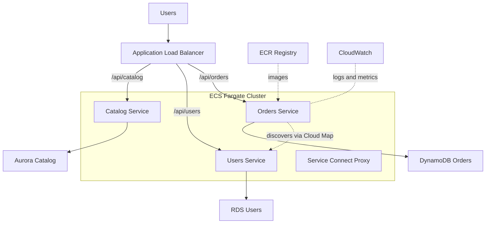

## What it is

Container microservices decompose an application into independently deployable services, each owning its data and API, packaged as containers and run on ECS or EKS. An ALB routes external traffic by path or host, while services talk to each other through service discovery or a service mesh.

**Use it when** multiple teams need to ship independently, services have different scaling profiles, or you need container portability. **Avoid it when** a small team is building a young product — a well-structured monolith or serverless API ships faster and defers the distributed-systems tax.

## Architecture

## Core components

| Component | Service | Role |
|---|---|---|
| Orchestrator | ECS Fargate or EKS | Schedules, heals, and scales containerized services |
| Image registry | ECR | Stores versioned, scanned container images |
| Ingress | Application Load Balancer | Path-based and host-based routing to service target groups |
| Service discovery | Cloud Map / ECS Service Connect | Lets services find each other by name instead of IP |
| Service-to-service | ECS Service Connect or App Mesh | Built-in proxy with retries, timeouts, and per-service traffic metrics |
| Data stores | DynamoDB, RDS, Aurora | Database per service — no shared schemas |
| Scaling | Application Auto Scaling | Adjusts task count per service on CPU, memory, or request count |
| Observability | CloudWatch, X-Ray | Centralized logs, metrics, and distributed traces |

## Design decisions and trade-offs

- **ECS Fargate vs EKS.** ECS is AWS-native, simpler, and has no control-plane fee — the right default for most teams. EKS buys the Kubernetes ecosystem (Helm, operators, portability) at the cost of a control-plane charge and materially more operational expertise. Choose EKS because you need Kubernetes, not because it is fashionable.
- **Fargate vs EC2 launch type.** Fargate removes host management and bills per task; EC2 launch type is cheaper at sustained high utilization and required for GPUs or daemon workloads.
- **Service mesh or not.** ECS Service Connect covers most needs — discovery, retries, telemetry — with near-zero setup. A full mesh such as App Mesh or Istio adds mTLS everywhere and fine-grained traffic shifting, plus a sidecar to operate. Note that App Mesh is deprecated for new adoption; prefer Service Connect on ECS or a Kubernetes-native mesh on EKS.
- **Database per service.** Each service owns its data store; cross-service access goes through APIs or events, never shared tables. This preserves independent deployability and forces you to confront eventual consistency explicitly.
- **Routing strategy.** One ALB with path-based rules is cheap and simple; per-service load balancers or an API Gateway front end add isolation, auth offloading, and cost.

## Well-Architected notes

- **Reliability** — tasks spread across AZs; ALB and orchestrator health checks replace failed tasks; retries with timeouts and circuit breaking at the Service Connect layer.
- **Security** — one IAM task role per service; ECR image scanning on push; security groups per service; secrets injected from Secrets Manager, never baked into images.
- **Performance efficiency** — each service scales on its own metric instead of scaling the whole application.
- **Cost optimization** — right-size task CPU and memory; Fargate Spot for interruption-tolerant services; Compute Savings Plans for the baseline.
- **Operational excellence** — one CI/CD pipeline per service; blue/green or canary deploys via CodeDeploy or weighted target groups.

## Common interview questions

- **Q: ECS or EKS — how do you choose?** A: ECS for AWS-native simplicity and lower operational cost; EKS when you need the Kubernetes ecosystem, multi-cloud portability, or already have K8s expertise. The workload rarely decides — the team does.
- **Q: How do services find and call each other?** A: Cloud Map DNS-based discovery, or ECS Service Connect which adds a managed proxy with retries and metrics; on EKS, native Kubernetes services and CoreDNS.
- **Q: How do you deploy one service without breaking its consumers?** A: Versioned, backward-compatible APIs; expand-and-contract for schema changes; canary or blue/green rollout with automatic rollback on alarm.
- **Q: One database for all services — why is that a problem?** A: A shared schema couples deployments (a migration for one service can break another), serializes teams, and turns the database into a scaling and blast-radius bottleneck. Database-per-service trades that for eventual consistency handled via events.

## Related lab

Build this end to end in [Lab 3: Microservices on ECS](../../labs/lab-03-microservices-ecs).
