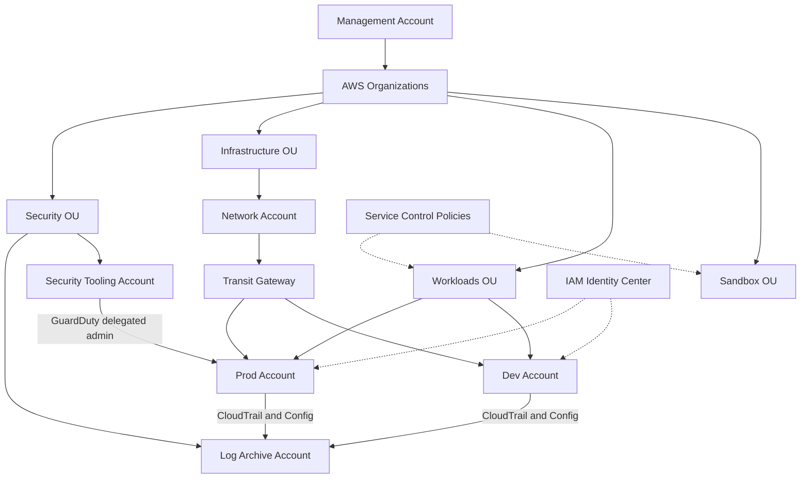

## What it is

A landing zone is a pre-built, governed multi-account AWS environment: AWS Organizations provides the account structure, Control Tower automates guardrails and account vending, service control policies set hard permission boundaries, and dedicated accounts centralize logging, security tooling, and shared networking. Accounts — not VPCs or IAM boundaries alone — are the strongest isolation unit AWS offers.

**Use it when** more than a handful of teams or workloads share AWS, when compliance demands separation of duties, or when blast radius must be contained by design. Even solo builders benefit from a minimal version: separate management, workload, and sandbox accounts.

## Architecture

## Core components

| Component | Service | Role |
|---|---|---|
| Account structure | AWS Organizations | Root of the hierarchy, OUs, consolidated billing |
| Landing zone automation | Control Tower | Sets up the baseline, applies guardrails, vends new accounts via Account Factory |
| Permission ceilings | Service control policies | Deny-based boundaries no one in the account can exceed, even root |
| Workforce access | IAM Identity Center | SSO from your identity provider; permission sets instead of per-account IAM users |
| Log archive | Dedicated account + S3 | Immutable, org-wide CloudTrail and Config history that workload admins cannot touch |
| Security tooling | Dedicated account | Delegated admin for GuardDuty, Security Hub, Detective across all accounts |
| Shared network | Network account + Transit Gateway | Central hub for VPC connectivity, egress inspection, VPN and Direct Connect |
| Resource sharing | AWS RAM | Shares subnets, Transit Gateway, and other resources across accounts |

## Design decisions and trade-offs

- **Organize OUs by function, not org chart.** Security, Infrastructure, Workloads (split Prod and Non-Prod), Sandbox. Policies attach to OUs, so the tree should mirror how policy differs — reorganizing later is painful.
- **Control Tower vs hand-rolled Organizations.** Control Tower gives you the AWS-recommended baseline, guardrails, and account vending with little effort but limited flexibility; a custom setup (often with Landing Zone Accelerator or Terraform) suits organizations with strong opinions. Default to Control Tower and customize around it.
- **SCPs are guardrails, not grants.** They never give permissions — they cap them. Classic examples: deny leaving the organization, deny disabling CloudTrail or GuardDuty, deny regions you do not operate in, deny actions without MFA. Keep them coarse; fine-grained control stays in IAM.
- **Keep the management account empty.** No workloads, minimal human access. It is the highest-privilege account in the org and its only jobs are billing, Organizations, and delegating administration elsewhere.
- **Centralized vs distributed networking.** A network account with Transit Gateway and shared subnets via RAM centralizes inspection, egress, and hybrid connectivity, and stops the NxN VPC peering mesh — at the price of TGW data processing cost and a team that owns the hub.
- **Account vending must be automated.** If creating a compliant account takes a ticket and a week, teams will pile unrelated workloads into existing accounts and erode isolation. Account Factory or IaC-driven vending keeps the boundary cheap to use.

## Well-Architected notes

- **Security** — account boundaries contain blast radius; SCPs enforce non-negotiables; org-wide CloudTrail to an account workload admins cannot modify; delegated security tooling sees everything.
- **Operational excellence** — new accounts arrive pre-baselined; guardrail drift is detected by Control Tower and Config.
- **Reliability** — service quotas and throttles are per account, so isolating workloads prevents one team's burst from starving another.
- **Cost optimization** — consolidated billing aggregates discounts; per-account cost allocation is automatic, no tagging discipline required for the top level.
- **Sustainability** — region deny-lists keep workloads in intended regions and prevent forgotten sprawl.

## Common interview questions

- **Q: Why multiple accounts instead of separating with VPCs and IAM in one account?** A: Accounts are the hardest boundary — separate service quotas, blast radius, billing, and a default-deny wall that no IAM misconfiguration inside a workload account can cross. VPCs isolate networks, not API-level access.
- **Q: What belongs in an SCP versus IAM?** A: SCPs express organizational invariants — deny CloudTrail tampering, deny unapproved regions, deny org exit. IAM handles who can do what day to day. An SCP cannot grant anything, so it complements rather than replaces IAM.
- **Q: How do developers log in across 30 accounts?** A: IAM Identity Center federated with the corporate IdP; users get permission sets mapped to accounts and assume short-lived roles — no long-lived IAM users or access keys anywhere.
- **Q: How do you guarantee audit logs survive a compromised prod account?** A: Organization-level CloudTrail delivers to an S3 bucket in the log archive account with a deny-delete bucket policy and Object Lock; prod admins have no write or delete path to it.

## Related lab

The multi-account guardrail baseline is part of getting started — see [Getting Started](../../getting-started) for account setup, then apply the resilience patterns in [Lab 6: DR Failover](../../labs/lab-06-dr-failover) across accounts.
