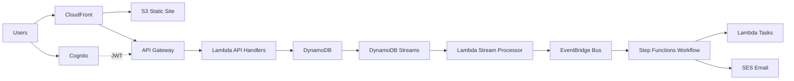

## What it is

Serverless architecture composes fully managed, pay-per-use services — API Gateway, Lambda, DynamoDB, S3, Step Functions — so there are no instances to size, patch, or scale. Capacity scales from zero to thousands of concurrent executions automatically, and you pay only for requests actually served.

**Use it when** traffic is spiky or unpredictable, the team is small and wants minimal operational load, or you are building APIs, webhooks, and glue logic. **Be careful when** you have long-running compute (Lambda caps at 15 minutes), very steady high throughput (always-on containers can be cheaper), or hard latency floors where cold starts hurt.

## Architecture

## Core components

| Component | Service | Role |
|---|---|---|
| Front door | API Gateway | HTTPS endpoint, throttling, request validation, JWT authorization |
| Authentication | Cognito | User pools issue tokens; API Gateway validates them natively |
| Compute | Lambda | Stateless functions per route or per domain, scale to zero |
| Data store | DynamoDB | Single-digit-millisecond NoSQL with on-demand capacity |
| Static hosting | S3 + CloudFront | SPA assets served from the edge |
| Orchestration | Step Functions | Multi-step workflows with retries, branching, and human-visible state |
| Event bus | EventBridge | Decouples domains; routes events by rule to consumers |
| Change feed | DynamoDB Streams | Triggers downstream processing on every write |

## Design decisions and trade-offs

- **REST vs HTTP API.** API Gateway HTTP APIs are roughly 70 percent cheaper and lower latency; REST APIs add usage plans, API keys, request/response transformation, and WAF on edge-optimized endpoints. Default to HTTP APIs unless you need REST features.
- **Cold starts.** Mitigate with smaller deployment packages, ARM Graviton runtimes, and provisioned concurrency on latency-critical paths — but provisioned concurrency reintroduces an always-on cost.
- **DynamoDB modeling.** Single-table design optimizes for known access patterns and cost, at the price of upfront modeling effort and a learning curve. Design the access patterns before the table, not after.
- **Orchestration vs choreography.** Use Step Functions when a workflow needs visibility, retries, and compensation; use EventBridge events when domains should evolve independently. Standard workflows for long-running processes, Express for high-volume short ones.
- **Lambda granularity.** One function per route is easy to reason about and gives fine-grained IAM; a "Lambdalith" per service reduces cold-start surface and deployment overhead. Either is defensible — be consistent.

## Well-Architected notes

- **Reliability** — every service here is multi-AZ by default; add DLQs on async Lambda invocations and Step Functions retry policies.
- **Security** — one narrowly scoped IAM role per function; Cognito plus API Gateway authorizers keep auth out of your code.
- **Performance efficiency** — scale from zero to thousands of concurrent executions with no capacity planning; watch account-level concurrency limits.
- **Cost optimization** — true pay-per-request; idle cost is near zero, which is ideal for portfolio projects you leave running.
- **Operational excellence** — no servers to patch; invest instead in structured logging, tracing with X-Ray, and infrastructure as code such as SAM or CDK.

## Common interview questions

- **Q: How do you handle a Lambda that needs more than 15 minutes?** A: Break it into a Step Functions workflow, hand it to ECS Fargate for the long-running piece, or restructure as incremental event-driven processing.
- **Q: How do you keep DynamoDB from throttling under a hot key?** A: Distribute the partition key with write sharding, cache hot reads with DAX or ElastiCache, and use on-demand capacity for unpredictable load.
- **Q: What is the concurrency story when traffic spikes 100x?** A: Lambda scales per-request up to the account concurrency limit; protect downstreams with reserved concurrency, SQS buffering between API and worker, and API Gateway throttling.
- **Q: When would you not choose serverless?** A: Steady saturated traffic where Fargate or EC2 is cheaper, latency-critical paths intolerant of cold starts, long-lived connections such as game servers, or heavy dependencies on OS-level customization.

## Related lab

Build this end to end in [Lab 2: Serverless API](../../labs/lab-02-serverless-api).
