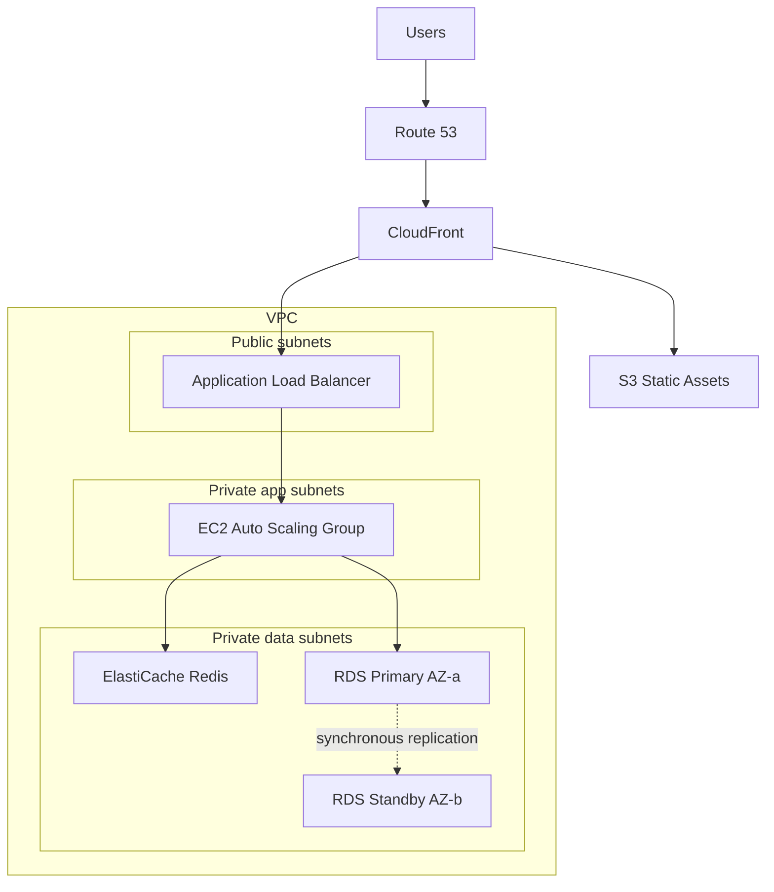

## What it is

The three-tier pattern separates a web application into a presentation tier (edge and load balancing), an application tier (stateless compute), and a data tier (managed database plus cache). It is the default answer for traditional web applications, lift-and-shift migrations, and any workload where the team is comfortable operating servers.

**Use it when** traffic is reasonably predictable, the application expects a relational database, or you are migrating an existing VM-based app. **Avoid it when** traffic is extremely spiky and idle capacity would dominate cost — serverless usually wins there.

## Architecture

## Core components

| Component | Service | Role |
|---|---|---|
| DNS | Route 53 | Public DNS, health checks, failover and latency routing |
| Edge / CDN | CloudFront | Caches static assets and offloads TLS close to users |
| Static content | S3 | Origin for images, JS, CSS behind CloudFront |
| Load balancer | Application Load Balancer | Terminates HTTPS, health-checks targets, spreads traffic across AZs |
| App compute | EC2 Auto Scaling Group | Stateless application servers scaling on demand |
| Cache | ElastiCache for Redis | Session store and read-through cache to protect the database |
| Database | RDS Multi-AZ | Managed relational database with synchronous standby in a second AZ |
| Secrets | Secrets Manager | Database credentials with automatic rotation |

## Design decisions and trade-offs

- **Stateless app tier.** Sessions live in ElastiCache or in signed cookies, never on instance disk. This is what makes Auto Scaling and rolling deployments safe.
- **Multi-AZ vs read replicas.** Multi-AZ is for availability (synchronous standby, automatic failover, same endpoint); read replicas are for read scaling (asynchronous, separate endpoints). Interviewers love this distinction — they solve different problems and are often combined.
- **Scaling policy.** Target tracking on average CPU or ALB request count per target is the sane default. Step scaling adds precision at the cost of tuning effort.
- **Where to cache.** CloudFront for static and cacheable dynamic content, ElastiCache for hot database reads. Each cache layer you add reduces cost and latency but adds an invalidation problem.
- **Cost profile.** You pay for instances whether or not they serve traffic. Reserved Instances or Savings Plans for the baseline, on-demand or Spot for the burst.

## Well-Architected notes

- **Reliability** — two or more AZs at every tier; ALB health checks eject bad instances; RDS Multi-AZ fails over automatically in one to two minutes.
- **Security** — security groups chained per tier (ALB to app, app to data); databases in private subnets with no public route; TLS end to end.
- **Performance efficiency** — CloudFront and ElastiCache absorb read traffic before it reaches EC2 or RDS.
- **Cost optimization** — Auto Scaling matches capacity to demand; Savings Plans cover the steady-state floor.
- **Operational excellence** — instances are cattle, not pets: bake AMIs or bootstrap with user data, deploy via instance refresh.

## Common interview questions

- **Q: The database is the bottleneck under read-heavy load. What do you do?** A: In order — add ElastiCache for hot reads, add RDS read replicas and route reads to them, then consider Aurora which supports up to 15 low-lag replicas behind a single reader endpoint.
- **Q: What happens during an AZ failure?** A: ALB stops routing to targets in the failed AZ, Auto Scaling launches replacements in healthy AZs, and RDS promotes the standby; the DNS endpoint stays the same so the app reconnects without config changes.
- **Q: How do you deploy without downtime?** A: Rolling replacement via Auto Scaling instance refresh, or blue/green with a second target group and weighted ALB rules; connection draining ensures in-flight requests finish.
- **Q: Multi-AZ or read replica for disaster recovery?** A: Neither alone — Multi-AZ is in-Region high availability. For DR you need a cross-Region read replica or Aurora Global Database plus Route 53 failover.

## Related lab

Build this end to end in [Lab 1: Three-Tier Web App](../../labs/lab-01-three-tier-web).
