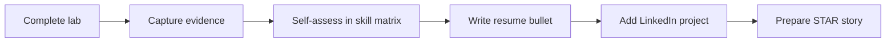

Hands-on labs only pay off in a job search if you **convert them into structured career assets**. A recruiter never sees your terminal history. What they see is a resume bullet, a LinkedIn profile, and — if those work — you at a whiteboard. Each of those is a different artifact, built from the same raw material: the labs you completed on this site.

Most self-taught AWS engineers stop at "I did the labs" and wonder why it does not register with employers. The gap is not skill — it is packaging. This section is the packaging workflow.

## The pipeline

Every lab you finish should flow through the same conversion pipeline:

**Capture evidence while it exists** — this is the step people miss. After teardown, the architecture is gone. Before you tear down, save: the architecture diagram (draw it yourself — that act is interview practice), key CLI outputs (the `dig` result showing DNS failover, the load test numbers), screenshots of the working system, and your command history cleaned up into a repo or gist. Ten minutes of capture turns an evening of work into a permanent asset.


Do the conversion **the same week** you finish a lab. The measurable details — how long failover took, how many requests the load test pushed, what the RDS failover did to error rates — evaporate from memory fast, and those details are exactly what makes a bullet or interview story credible.


## Pages in this section


  
  
  
  


## The honesty principle

One rule governs everything in this section: **labs are presented as what they are — self-directed projects — never as production experience**. That framing is not a weakness to hide. A candidate who says "I built and failed over a multi-region architecture in a personal lab, here is the repo" is more credible than one who vaguely implies production experience and collapses under the first follow-up question. Interviewers are very good at finding that collapse. Every page in this section repeats this rule in its own context because it is the difference between a portfolio and a liability.
