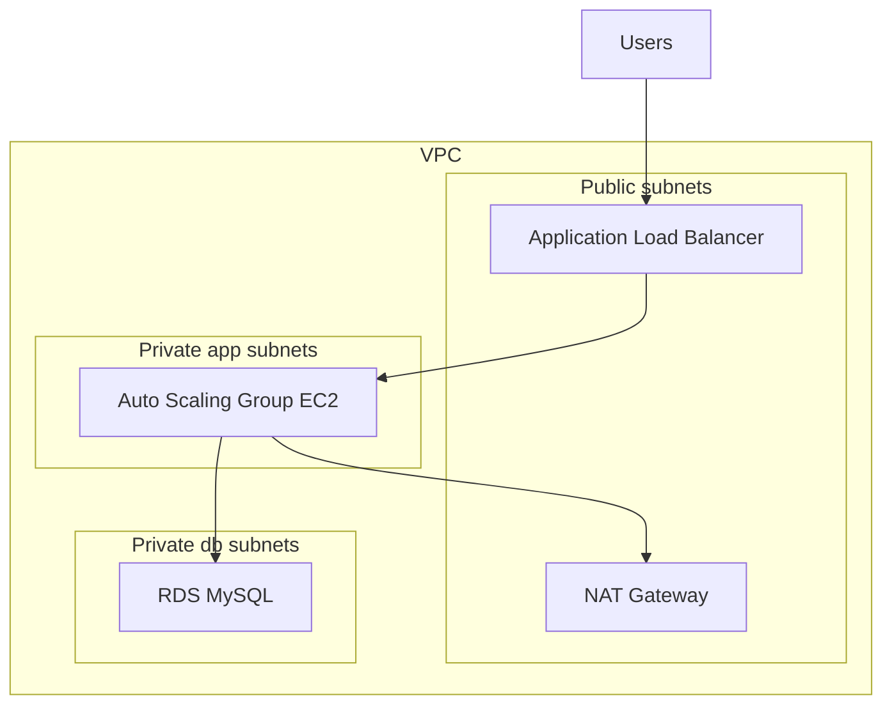

## Overview

You will deploy the classic AWS workhorse: a three-tier web application with a load-balanced, auto-scaling web tier in private subnets and a managed MySQL database. This is the single most common architecture in AWS interviews, and building it end to end with the CLI proves you understand networking, compute, and data tiers — not just the diagram.

- **Difficulty:** Intermediate
- **Estimated time:** 2–3 hours
- **Estimated cost:** $1–3 if torn down the same day. The ALB (~$0.023/h), two t3.micro instances (~$0.021/h combined), and a db.t3.micro RDS instance (~$0.017/h single-AZ) dominate the cost. Multi-AZ RDS roughly doubles the database cost — this lab defaults to **single-AZ** to save money and notes where Multi-AZ differs.

Companion pattern: [Three-Tier Web Architecture](../../architectures/three-tier-web/).


This lab creates hourly-billed resources: an Application Load Balancer, EC2 instances, and an RDS database. Left running for a month they would cost $50+. Complete the **Teardown** section in the same session, and verify the final checks return empty results.


## Architecture



## Prerequisites

- AWS CLI v2 configured with an admin-capable profile — see [Getting Started](../getting-started/).
- All commands assume **us-east-1**. Export `AWS_DEFAULT_REGION=us-east-1` or add `--region us-east-1` throughout.
- A budget alarm in place (strongly recommended before any lab with hourly billing).

## Build steps

{}

### Create the VPC and subnets

Create a VPC with two public and four private subnets across two Availability Zones.

```bash
VPC_ID=$(aws ec2 create-vpc --cidr-block 10.0.0.0/16 \
  --tag-specifications 'ResourceType=vpc,Tags=[{Key=Name,Value=lab01-vpc}]' \
  --query 'Vpc.VpcId' --output text)

aws ec2 modify-vpc-attribute --vpc-id $VPC_ID --enable-dns-hostnames

PUB_A=$(aws ec2 create-subnet --vpc-id $VPC_ID --cidr-block 10.0.1.0/24 \
  --availability-zone us-east-1a --query 'Subnet.SubnetId' --output text)
PUB_B=$(aws ec2 create-subnet --vpc-id $VPC_ID --cidr-block 10.0.2.0/24 \
  --availability-zone us-east-1b --query 'Subnet.SubnetId' --output text)
APP_A=$(aws ec2 create-subnet --vpc-id $VPC_ID --cidr-block 10.0.11.0/24 \
  --availability-zone us-east-1a --query 'Subnet.SubnetId' --output text)
APP_B=$(aws ec2 create-subnet --vpc-id $VPC_ID --cidr-block 10.0.12.0/24 \
  --availability-zone us-east-1b --query 'Subnet.SubnetId' --output text)
DB_A=$(aws ec2 create-subnet --vpc-id $VPC_ID --cidr-block 10.0.21.0/24 \
  --availability-zone us-east-1a --query 'Subnet.SubnetId' --output text)
DB_B=$(aws ec2 create-subnet --vpc-id $VPC_ID --cidr-block 10.0.22.0/24 \
  --availability-zone us-east-1b --query 'Subnet.SubnetId' --output text)
```

### Add internet and NAT routing

Attach an internet gateway for the public subnets and one NAT gateway for the private app subnets. A single NAT gateway is a cost compromise — production would use one per AZ.

```bash
IGW_ID=$(aws ec2 create-internet-gateway \
  --query 'InternetGateway.InternetGatewayId' --output text)
aws ec2 attach-internet-gateway --internet-gateway-id $IGW_ID --vpc-id $VPC_ID

PUB_RT=$(aws ec2 create-route-table --vpc-id $VPC_ID \
  --query 'RouteTable.RouteTableId' --output text)
aws ec2 create-route --route-table-id $PUB_RT \
  --destination-cidr-block 0.0.0.0/0 --gateway-id $IGW_ID
aws ec2 associate-route-table --route-table-id $PUB_RT --subnet-id $PUB_A
aws ec2 associate-route-table --route-table-id $PUB_RT --subnet-id $PUB_B

EIP_ALLOC=$(aws ec2 allocate-address --domain vpc \
  --query 'AllocationId' --output text)
NAT_ID=$(aws ec2 create-nat-gateway --subnet-id $PUB_A \
  --allocation-id $EIP_ALLOC --query 'NatGateway.NatGatewayId' --output text)
aws ec2 wait nat-gateway-available --nat-gateway-ids $NAT_ID

PRIV_RT=$(aws ec2 create-route-table --vpc-id $VPC_ID \
  --query 'RouteTable.RouteTableId' --output text)
aws ec2 create-route --route-table-id $PRIV_RT \
  --destination-cidr-block 0.0.0.0/0 --nat-gateway-id $NAT_ID
aws ec2 associate-route-table --route-table-id $PRIV_RT --subnet-id $APP_A
aws ec2 associate-route-table --route-table-id $PRIV_RT --subnet-id $APP_B
```

### Create security groups

Three groups, chained: internet to ALB on 80, ALB to app on 80, app to database on 3306.

```bash
ALB_SG=$(aws ec2 create-security-group --group-name lab01-alb-sg \
  --description "ALB ingress" --vpc-id $VPC_ID \
  --query 'GroupId' --output text)
aws ec2 authorize-security-group-ingress --group-id $ALB_SG \
  --protocol tcp --port 80 --cidr 0.0.0.0/0

APP_SG=$(aws ec2 create-security-group --group-name lab01-app-sg \
  --description "App tier" --vpc-id $VPC_ID \
  --query 'GroupId' --output text)
aws ec2 authorize-security-group-ingress --group-id $APP_SG \
  --protocol tcp --port 80 --source-group $ALB_SG

DB_SG=$(aws ec2 create-security-group --group-name lab01-db-sg \
  --description "DB tier" --vpc-id $VPC_ID \
  --query 'GroupId' --output text)
aws ec2 authorize-security-group-ingress --group-id $DB_SG \
  --protocol tcp --port 3306 --source-group $APP_SG
```

### Create the RDS MySQL database

Single-AZ db.t3.micro to keep costs down. For the Multi-AZ experience — synchronous standby, automatic failover, ~2x cost — replace `--no-multi-az` with `--multi-az`. Everything else is identical.

```bash
aws rds create-db-subnet-group --db-subnet-group-name lab01-db-subnets \
  --db-subnet-group-description "Lab 1 DB subnets" \
  --subnet-ids $DB_A $DB_B

DB_PASS=$(openssl rand -base64 18)
echo "DB password: $DB_PASS"

aws rds create-db-instance --db-instance-identifier lab01-mysql \
  --db-instance-class db.t3.micro --engine mysql \
  --allocated-storage 20 --storage-type gp3 \
  --master-username admin --master-user-password "$DB_PASS" \
  --db-subnet-group-name lab01-db-subnets \
  --vpc-security-group-ids $DB_SG \
  --no-multi-az --no-publicly-accessible \
  --backup-retention-period 0

aws rds wait db-instance-available --db-instance-identifier lab01-mysql

DB_ENDPOINT=$(aws rds describe-db-instances \
  --db-instance-identifier lab01-mysql \
  --query 'DBInstances[0].Endpoint.Address' --output text)
```

The wait takes 5–10 minutes single-AZ, 15–20 minutes Multi-AZ. Continue with the next steps in a second terminal if you like.

### Create the launch template and Auto Scaling group

The user data installs Apache and serves a page showing which instance answered — that visible round-robin is your load-balancing proof.

```bash
AMI_ID=$(aws ssm get-parameters \
  --names /aws/service/ami-amazon-linux-latest/al2023-ami-kernel-default-x86_64 \
  --query 'Parameters[0].Value' --output text)

cat > /tmp/lab01-userdata.sh <<'EOF'
#!/bin/bash
dnf install -y httpd
TOKEN=$(curl -s -X PUT http://169.254.169.254/latest/api/token \
  -H "X-aws-ec2-metadata-token-ttl-seconds: 300")
IID=$(curl -s -H "X-aws-ec2-metadata-token: $TOKEN" \
  http://169.254.169.254/latest/meta-data/instance-id)
echo "<h1>Lab 1 web tier</h1><p>Served by $IID</p>" > /var/www/html/index.html
systemctl enable --now httpd
EOF

aws ec2 create-launch-template --launch-template-name lab01-lt \
  --launch-template-data "{
    \"ImageId\": \"$AMI_ID\",
    \"InstanceType\": \"t3.micro\",
    \"SecurityGroupIds\": [\"$APP_SG\"],
    \"UserData\": \"$(base64 -i /tmp/lab01-userdata.sh)\"
  }"

aws autoscaling create-auto-scaling-group \
  --auto-scaling-group-name lab01-asg \
  --launch-template LaunchTemplateName=lab01-lt \
  --min-size 2 --max-size 4 --desired-capacity 2 \
  --vpc-zone-identifier "$APP_A,$APP_B" \
  --health-check-type ELB --health-check-grace-period 120
```

### Create the ALB and wire it to the ASG

```bash
ALB_ARN=$(aws elbv2 create-load-balancer --name lab01-alb \
  --subnets $PUB_A $PUB_B --security-groups $ALB_SG \
  --query 'LoadBalancers[0].LoadBalancerArn' --output text)

TG_ARN=$(aws elbv2 create-target-group --name lab01-tg \
  --protocol HTTP --port 80 --vpc-id $VPC_ID \
  --health-check-path / --target-type instance \
  --query 'TargetGroups[0].TargetGroupArn' --output text)

aws elbv2 create-listener --load-balancer-arn $ALB_ARN \
  --protocol HTTP --port 80 \
  --default-actions Type=forward,TargetGroupArn=$TG_ARN

aws autoscaling attach-load-balancer-target-groups \
  --auto-scaling-group-name lab01-asg --target-group-arns $TG_ARN

ALB_DNS=$(aws elbv2 describe-load-balancers --load-balancer-arns $ALB_ARN \
  --query 'LoadBalancers[0].DNSName' --output text)
echo "http://$ALB_DNS"
```

{}

## Verify

Wait 2–3 minutes for instances to pass health checks, then confirm both targets are healthy:

```bash
aws elbv2 describe-target-health --target-group-arn $TG_ARN \
  --query 'TargetHealthDescriptions[].TargetHealth.State'
```

Success looks like `["healthy", "healthy"]`. Then prove load balancing:

```bash
for i in 1 2 3 4; do curl -s http://$ALB_DNS | grep Served; done
```

You should see **two different instance IDs** alternating — that is the ALB distributing traffic across AZs. Finally, confirm the database is reachable in-VPC (the endpoint resolves to a private IP):

```bash
aws rds describe-db-instances --db-instance-identifier lab01-mysql \
  --query 'DBInstances[0].[DBInstanceStatus,MultiAZ,Endpoint.Address]'
```

Status `available` with your chosen Multi-AZ setting proves the data tier is live.

## Capture your evidence

- Screenshot the `curl` loop output showing two instance IDs behind one ALB DNS name — the clearest proof of a working load-balanced tier.
- Screenshot the VPC console **Resource map** view showing subnets, route tables, and the NAT gateway across two AZs.
- Screenshot the target group health page and the RDS instance details showing the private endpoint and AZ configuration.

## Teardown

Delete in reverse dependency order. The NAT gateway and ALB are the resources most often forgotten.

```bash
aws autoscaling update-auto-scaling-group --auto-scaling-group-name lab01-asg \
  --min-size 0 --max-size 0 --desired-capacity 0
aws autoscaling delete-auto-scaling-group --auto-scaling-group-name lab01-asg \
  --force-delete
aws ec2 delete-launch-template --launch-template-name lab01-lt

aws elbv2 delete-load-balancer --load-balancer-arn $ALB_ARN
aws elbv2 wait load-balancers-deleted --load-balancer-arns $ALB_ARN
aws elbv2 delete-target-group --target-group-arn $TG_ARN

aws rds delete-db-instance --db-instance-identifier lab01-mysql \
  --skip-final-snapshot
aws rds wait db-instance-deleted --db-instance-identifier lab01-mysql
aws rds delete-db-subnet-group --db-subnet-group-name lab01-db-subnets

aws ec2 delete-nat-gateway --nat-gateway-id $NAT_ID
aws ec2 wait nat-gateway-deleted --nat-gateway-ids $NAT_ID
aws ec2 release-address --allocation-id $EIP_ALLOC

aws ec2 delete-security-group --group-id $DB_SG
aws ec2 delete-security-group --group-id $APP_SG
aws ec2 delete-security-group --group-id $ALB_SG

aws ec2 delete-route-table --route-table-id $PRIV_RT
aws ec2 delete-route-table --route-table-id $PUB_RT
for S in $PUB_A $PUB_B $APP_A $APP_B $DB_A $DB_B; do
  aws ec2 delete-subnet --subnet-id $S
done
aws ec2 detach-internet-gateway --internet-gateway-id $IGW_ID --vpc-id $VPC_ID
aws ec2 delete-internet-gateway --internet-gateway-id $IGW_ID
aws ec2 delete-vpc --vpc-id $VPC_ID
```

Confirm nothing billable remains — all four checks should return empty:

```bash
aws ec2 describe-instances --filters "Name=vpc-id,Values=$VPC_ID" \
  "Name=instance-state-name,Values=running" --query 'Reservations'
aws elbv2 describe-load-balancers --query "LoadBalancers[?VpcId=='$VPC_ID']"
aws rds describe-db-instances --query "DBInstances[?DBInstanceIdentifier=='lab01-mysql']"
aws ec2 describe-nat-gateways --filter "Name=vpc-id,Values=$VPC_ID" \
  --query "NatGateways[?State!='deleted']"
```

## Resume bullet

> Designed and deployed a highly available three-tier web application on AWS across two Availability Zones, using an Application Load Balancer, EC2 Auto Scaling, and RDS MySQL in isolated private subnets with least-privilege security group chaining.

See the [Career Toolkit](../../career/) for how to adapt this to your resume and LinkedIn.
