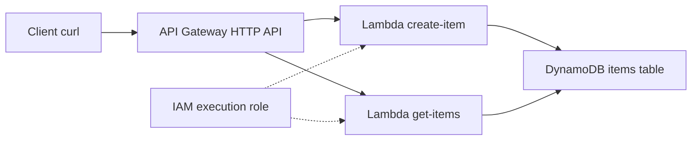

## Overview

You will build a fully serverless REST API: an API Gateway HTTP API in front of Python Lambda functions reading and writing a DynamoDB table, with a least-privilege IAM role. There are no servers to patch and — crucially for a lab — **almost nothing that bills while idle**, which makes this the best first lab on the site.

- **Difficulty:** Beginner
- **Estimated time:** 1–1.5 hours
- **Estimated cost:** Under $0.25. Lambda, API Gateway HTTP APIs, and DynamoDB on-demand all bill per request, and lab traffic stays comfortably inside the free tier for most accounts.

Companion pattern: [Serverless Architecture](../../architectures/serverless/).


Even though idle cost is near zero, do not skip the **Teardown** section. Orphaned IAM roles and forgotten tables clutter your account and hide real problems later. Build the habit now, while the stakes are low.


## Architecture



## Prerequisites

- AWS CLI v2 configured — see [Getting Started](../getting-started/).
- Region assumption: **us-east-1**.
- `python3` and `zip` available locally, plus `curl` for testing.

## Build steps

{}

### Create the DynamoDB table

On-demand billing means you pay per request, with no idle charge.

```bash
aws dynamodb create-table --table-name lab02-items \
  --attribute-definitions AttributeName=id,AttributeType=S \
  --key-schema AttributeName=id,KeyType=HASH \
  --billing-mode PAY_PER_REQUEST

aws dynamodb wait table-exists --table-name lab02-items
```

### Create the Lambda execution role

The role trusts Lambda, gets basic CloudWatch logging, and an inline policy scoped to **this table only** — no wildcard resources.

```bash
ACCOUNT_ID=$(aws sts get-caller-identity --query Account --output text)

ROLE_ARN=$(aws iam create-role --role-name lab02-lambda-role \
  --assume-role-policy-document '{
    "Version": "2012-10-17",
    "Statement": [{
      "Effect": "Allow",
      "Principal": {"Service": "lambda.amazonaws.com"},
      "Action": "sts:AssumeRole"
    }]
  }' --query 'Role.Arn' --output text)

aws iam attach-role-policy --role-name lab02-lambda-role \
  --policy-arn arn:aws:iam::aws:policy/service-role/AWSLambdaBasicExecutionRole

aws iam put-role-policy --role-name lab02-lambda-role \
  --policy-name lab02-ddb-access \
  --policy-document "{
    \"Version\": \"2012-10-17\",
    \"Statement\": [{
      \"Effect\": \"Allow\",
      \"Action\": [\"dynamodb:PutItem\", \"dynamodb:Scan\", \"dynamodb:GetItem\"],
      \"Resource\": \"arn:aws:dynamodb:us-east-1:$ACCOUNT_ID:table/lab02-items\"
    }]
  }"

sleep 10
```

The `sleep` gives IAM time to propagate before Lambda tries to assume the role.

### Write and package the Lambda functions

Two small Python handlers: one writes an item, one scans the table.

```bash
mkdir -p /tmp/lab02 && cd /tmp/lab02

cat > create_item.py <<'EOF'
import json, uuid, boto3

table = boto3.resource("dynamodb").Table("lab02-items")

def handler(event, context):
    body = json.loads(event.get("body") or "{}")
    item = {"id": str(uuid.uuid4()), "name": body.get("name", "unnamed")}
    table.put_item(Item=item)
    return {"statusCode": 201, "body": json.dumps(item)}
EOF

cat > get_items.py <<'EOF'
import json, boto3

table = boto3.resource("dynamodb").Table("lab02-items")

def handler(event, context):
    items = table.scan(Limit=25).get("Items", [])
    return {"statusCode": 200, "body": json.dumps(items)}
EOF

zip create_item.zip create_item.py
zip get_items.zip get_items.py
```

### Deploy the Lambda functions

```bash
CREATE_ARN=$(aws lambda create-function --function-name lab02-create-item \
  --runtime python3.12 --handler create_item.handler \
  --zip-file fileb://create_item.zip --role $ROLE_ARN \
  --timeout 10 --query 'FunctionArn' --output text)

GET_ARN=$(aws lambda create-function --function-name lab02-get-items \
  --runtime python3.12 --handler get_items.handler \
  --zip-file fileb://get_items.zip --role $ROLE_ARN \
  --timeout 10 --query 'FunctionArn' --output text)

aws lambda wait function-active --function-name lab02-create-item
aws lambda wait function-active --function-name lab02-get-items
```

### Create the HTTP API and routes

The `quick-create` shortcut wires the first integration; the second route is added explicitly.

```bash
API_ID=$(aws apigatewayv2 create-api --name lab02-api \
  --protocol-type HTTP --target $GET_ARN \
  --route-key 'GET /items' --query 'ApiId' --output text)

CREATE_INT=$(aws apigatewayv2 create-integration --api-id $API_ID \
  --integration-type AWS_PROXY --integration-uri $CREATE_ARN \
  --payload-format-version 2.0 --query 'IntegrationId' --output text)

aws apigatewayv2 create-route --api-id $API_ID \
  --route-key 'POST /items' --target integrations/$CREATE_INT

API_URL="https://$API_ID.execute-api.us-east-1.amazonaws.com"
echo $API_URL
```

### Grant API Gateway permission to invoke Lambda

```bash
aws lambda add-permission --function-name lab02-get-items \
  --statement-id apigw-get --action lambda:InvokeFunction \
  --principal apigateway.amazonaws.com \
  --source-arn "arn:aws:execute-api:us-east-1:$ACCOUNT_ID:$API_ID/*/*/items"

aws lambda add-permission --function-name lab02-create-item \
  --statement-id apigw-post --action lambda:InvokeFunction \
  --principal apigateway.amazonaws.com \
  --source-arn "arn:aws:execute-api:us-east-1:$ACCOUNT_ID:$API_ID/*/*/items"
```

{}

## Verify

Create two items, then list them:

```bash
curl -s -X POST $API_URL/items \
  -H 'Content-Type: application/json' -d '{"name": "first"}'
curl -s -X POST $API_URL/items \
  -H 'Content-Type: application/json' -d '{"name": "second"}'

curl -s $API_URL/items
```

Each POST should return HTTP 201 with a JSON body containing a generated `id`, and the GET should return both items. Cross-check that the data really landed in DynamoDB:

```bash
aws dynamodb scan --table-name lab02-items --query 'Count'
```

A count of `2` proves the full path — API Gateway to Lambda to DynamoDB — works with the scoped IAM role.

## Capture your evidence

- Terminal screenshot of the `curl` POST and GET round trip showing JSON responses from your live API URL.
- The Lambda console **Monitor** tab showing invocation and duration metrics after your test calls.
- The DynamoDB console item explorer showing the stored items, alongside the inline IAM policy that scopes access to one table.

## Teardown

```bash
aws apigatewayv2 delete-api --api-id $API_ID
aws lambda delete-function --function-name lab02-create-item
aws lambda delete-function --function-name lab02-get-items

aws iam delete-role-policy --role-name lab02-lambda-role \
  --policy-name lab02-ddb-access
aws iam detach-role-policy --role-name lab02-lambda-role \
  --policy-arn arn:aws:iam::aws:policy/service-role/AWSLambdaBasicExecutionRole
aws iam delete-role --role-name lab02-lambda-role

aws dynamodb delete-table --table-name lab02-items
aws dynamodb wait table-not-exists --table-name lab02-items
```

Confirm nothing remains — all three should return empty or error with not-found:

```bash
aws apigatewayv2 get-apis --query "Items[?Name=='lab02-api']"
aws lambda list-functions \
  --query "Functions[?starts_with(FunctionName, 'lab02')].FunctionName"
aws dynamodb list-tables --query "TableNames[?@=='lab02-items']"
```

## Resume bullet

> Built a serverless REST API on AWS using API Gateway, Python Lambda functions, and DynamoDB with least-privilege IAM policies, achieving zero idle infrastructure cost and per-request scaling.

See the [Career Toolkit](../../career/) for how to adapt this to your resume and LinkedIn.
