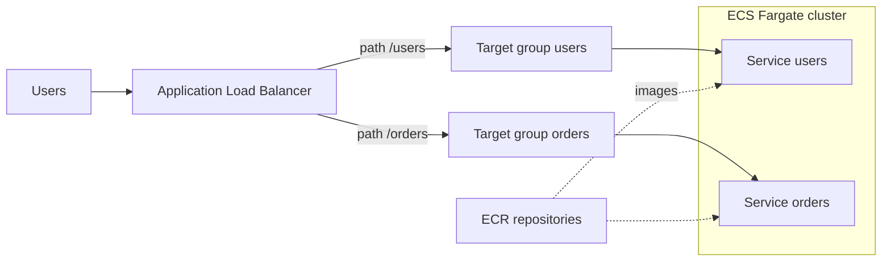

## Overview

You will run two independently deployable containerized services — `users` and `orders` — on ECS Fargate behind a single Application Load Balancer with path-based routing. You will build images locally, push them to ECR, write task definitions, and deploy two ECS services. This is the standard entry point to container orchestration on AWS without managing EC2 hosts.

- **Difficulty:** Intermediate
- **Estimated time:** 2–3 hours
- **Estimated cost:** $1–2 for a same-day session. The ALB (~$0.023/h) and two small Fargate tasks (~$0.02/h combined at 0.25 vCPU / 0.5 GB each) are the main charges; ECR storage is pennies.

Companion pattern: [Microservices Architecture](../../architectures/microservices/).


The ALB and Fargate tasks bill hourly from the moment they start. Two forgotten services plus an ALB cost roughly $35/month. Run the **Teardown** section before you close your terminal, and check the final verification commands return nothing.


## Architecture



## Prerequisites

- AWS CLI v2 configured — see [Getting Started](../getting-started/).
- Region assumption: **us-east-1**.
- Docker Desktop or another Docker-compatible engine running locally.
- This lab uses your account's **default VPC** to stay focused on containers. If you deleted it, recreate it with `aws ec2 create-default-vpc`.

## Build steps

{}

### Create ECR repositories and log in

```bash
ACCOUNT_ID=$(aws sts get-caller-identity --query Account --output text)
ECR_BASE="$ACCOUNT_ID.dkr.ecr.us-east-1.amazonaws.com"

aws ecr create-repository --repository-name lab03/users
aws ecr create-repository --repository-name lab03/orders

aws ecr get-login-password | docker login --username AWS \
  --password-stdin $ECR_BASE
```

### Build and push the two service images

Each service is a tiny Python HTTP server that identifies itself — enough to prove routing.

```bash
mkdir -p /tmp/lab03 && cd /tmp/lab03

cat > app.py <<'EOF'
import http.server, json, os

SERVICE = os.environ.get("SERVICE_NAME", "unknown")

class Handler(http.server.BaseHTTPRequestHandler):
    def do_GET(self):
        body = json.dumps({"service": SERVICE, "path": self.path}).encode()
        self.send_response(200)
        self.send_header("Content-Type", "application/json")
        self.end_headers()
        self.wfile.write(body)

http.server.HTTPServer(("", 8080), Handler).serve_forever()
EOF

cat > Dockerfile <<'EOF'
FROM python:3.12-slim
COPY app.py /app.py
EXPOSE 8080
CMD ["python", "/app.py"]
EOF

docker build --platform linux/amd64 -t $ECR_BASE/lab03/users:v1 .
docker build --platform linux/amd64 -t $ECR_BASE/lab03/orders:v1 .
docker push $ECR_BASE/lab03/users:v1
docker push $ECR_BASE/lab03/orders:v1
```

The `--platform linux/amd64` flag matters on Apple Silicon — Fargate X86_64 tasks cannot run arm64 images.

### Create the cluster and task execution role

```bash
aws ecs create-cluster --cluster-name lab03-cluster

aws iam create-role --role-name lab03-task-exec-role \
  --assume-role-policy-document '{
    "Version": "2012-10-17",
    "Statement": [{
      "Effect": "Allow",
      "Principal": {"Service": "ecs-tasks.amazonaws.com"},
      "Action": "sts:AssumeRole"
    }]
  }'

aws iam attach-role-policy --role-name lab03-task-exec-role \
  --policy-arn arn:aws:iam::aws:policy/service-role/AmazonECSTaskExecutionRolePolicy
```

### Register task definitions

One definition per service; the only differences are the image and the `SERVICE_NAME` environment variable.

```bash
for SVC in users orders; do
  aws ecs register-task-definition \
    --family lab03-$SVC \
    --requires-compatibilities FARGATE \
    --network-mode awsvpc --cpu 256 --memory 512 \
    --execution-role-arn arn:aws:iam::$ACCOUNT_ID:role/lab03-task-exec-role \
    --container-definitions "[{
      \"name\": \"$SVC\",
      \"image\": \"$ECR_BASE/lab03/$SVC:v1\",
      \"portMappings\": [{\"containerPort\": 8080, \"protocol\": \"tcp\"}],
      \"environment\": [{\"name\": \"SERVICE_NAME\", \"value\": \"$SVC\"}],
      \"essential\": true
    }]"
done
```

### Create the ALB with path-based routing

The listener default action serves `/users*`; a rule sends `/orders*` to the second target group.

```bash
VPC_ID=$(aws ec2 describe-vpcs --filters Name=is-default,Values=true \
  --query 'Vpcs[0].VpcId' --output text)
SUBNETS=$(aws ec2 describe-subnets --filters "Name=vpc-id,Values=$VPC_ID" \
  --query 'Subnets[0:2].SubnetId' --output text)

ALB_SG=$(aws ec2 create-security-group --group-name lab03-alb-sg \
  --description "Lab 3 ALB" --vpc-id $VPC_ID --query 'GroupId' --output text)
aws ec2 authorize-security-group-ingress --group-id $ALB_SG \
  --protocol tcp --port 80 --cidr 0.0.0.0/0

SVC_SG=$(aws ec2 create-security-group --group-name lab03-svc-sg \
  --description "Lab 3 services" --vpc-id $VPC_ID --query 'GroupId' --output text)
aws ec2 authorize-security-group-ingress --group-id $SVC_SG \
  --protocol tcp --port 8080 --source-group $ALB_SG

ALB_ARN=$(aws elbv2 create-load-balancer --name lab03-alb \
  --subnets $SUBNETS --security-groups $ALB_SG \
  --query 'LoadBalancers[0].LoadBalancerArn' --output text)

TG_USERS=$(aws elbv2 create-target-group --name lab03-tg-users \
  --protocol HTTP --port 8080 --vpc-id $VPC_ID --target-type ip \
  --health-check-path /users \
  --query 'TargetGroups[0].TargetGroupArn' --output text)
TG_ORDERS=$(aws elbv2 create-target-group --name lab03-tg-orders \
  --protocol HTTP --port 8080 --vpc-id $VPC_ID --target-type ip \
  --health-check-path /orders \
  --query 'TargetGroups[0].TargetGroupArn' --output text)

LISTENER_ARN=$(aws elbv2 create-listener --load-balancer-arn $ALB_ARN \
  --protocol HTTP --port 80 \
  --default-actions Type=forward,TargetGroupArn=$TG_USERS \
  --query 'Listeners[0].ListenerArn' --output text)

aws elbv2 create-rule --listener-arn $LISTENER_ARN --priority 10 \
  --conditions Field=path-pattern,Values='/orders*' \
  --actions Type=forward,TargetGroupArn=$TG_ORDERS

ALB_DNS=$(aws elbv2 describe-load-balancers --load-balancer-arns $ALB_ARN \
  --query 'LoadBalancers[0].DNSName' --output text)
```

### Deploy the two ECS services

`assignPublicIp=ENABLED` lets tasks in default-VPC public subnets pull from ECR without a NAT gateway — a lab-only shortcut.

```bash
SUBNET_LIST=$(echo $SUBNETS | tr ' \t' ',,')

aws ecs create-service --cluster lab03-cluster \
  --service-name users --task-definition lab03-users \
  --desired-count 1 --launch-type FARGATE \
  --network-configuration "awsvpcConfiguration={subnets=[$SUBNET_LIST],securityGroups=[$SVC_SG],assignPublicIp=ENABLED}" \
  --load-balancers "targetGroupArn=$TG_USERS,containerName=users,containerPort=8080"

aws ecs create-service --cluster lab03-cluster \
  --service-name orders --task-definition lab03-orders \
  --desired-count 1 --launch-type FARGATE \
  --network-configuration "awsvpcConfiguration={subnets=[$SUBNET_LIST],securityGroups=[$SVC_SG],assignPublicIp=ENABLED}" \
  --load-balancers "targetGroupArn=$TG_ORDERS,containerName=orders,containerPort=8080"

aws ecs wait services-stable --cluster lab03-cluster --services users orders
```

{}

## Verify

Confirm both services report a running task:

```bash
aws ecs describe-services --cluster lab03-cluster --services users orders \
  --query 'services[].[serviceName,runningCount,desiredCount]'
```

Both rows should show `1, 1`. Then hit the two paths through the single ALB:

```bash
curl -s http://$ALB_DNS/users
curl -s http://$ALB_DNS/orders
```

The first response must contain `"service": "users"` and the second `"service": "orders"` — proof that one load balancer is routing by path to two independent services. Also check both target groups report healthy targets:

```bash
aws elbv2 describe-target-health --target-group-arn $TG_USERS \
  --query 'TargetHealthDescriptions[].TargetHealth.State'
aws elbv2 describe-target-health --target-group-arn $TG_ORDERS \
  --query 'TargetHealthDescriptions[].TargetHealth.State'
```

## Capture your evidence

- Terminal screenshot showing `/users` and `/orders` returning different service identities from the same ALB DNS name.
- The ECS console cluster view with both services green, and one task detail page showing the Fargate launch type and ECR image URI.
- The ALB listener rules page showing the path-pattern rule — this is the routing story interviewers ask about.

## Teardown

```bash
aws ecs update-service --cluster lab03-cluster --service users --desired-count 0
aws ecs update-service --cluster lab03-cluster --service orders --desired-count 0
aws ecs delete-service --cluster lab03-cluster --service users --force
aws ecs delete-service --cluster lab03-cluster --service orders --force
aws ecs wait services-inactive --cluster lab03-cluster --services users orders
aws ecs delete-cluster --cluster lab03-cluster

aws elbv2 delete-load-balancer --load-balancer-arn $ALB_ARN
aws elbv2 wait load-balancers-deleted --load-balancer-arns $ALB_ARN
aws elbv2 delete-target-group --target-group-arn $TG_USERS
aws elbv2 delete-target-group --target-group-arn $TG_ORDERS

aws ecs deregister-task-definition --task-definition lab03-users:1
aws ecs deregister-task-definition --task-definition lab03-orders:1

aws ecr delete-repository --repository-name lab03/users --force
aws ecr delete-repository --repository-name lab03/orders --force

aws iam detach-role-policy --role-name lab03-task-exec-role \
  --policy-arn arn:aws:iam::aws:policy/service-role/AmazonECSTaskExecutionRolePolicy
aws iam delete-role --role-name lab03-task-exec-role

aws ec2 delete-security-group --group-id $SVC_SG
aws ec2 delete-security-group --group-id $ALB_SG
```

Confirm nothing billable remains — all three should return empty:

```bash
aws ecs list-clusters --query "clusterArns[?contains(@, 'lab03')]"
aws elbv2 describe-load-balancers \
  --query "LoadBalancers[?LoadBalancerName=='lab03-alb']"
aws ecr describe-repositories \
  --query "repositories[?starts_with(repositoryName, 'lab03')]"
```

## Resume bullet

> Deployed containerized microservices on Amazon ECS Fargate with an Application Load Balancer performing path-based routing, managing the full lifecycle from Docker image builds and ECR pushes to task definitions and rolling service deployments.

See the [Career Toolkit](../../career/) for how to adapt this to your resume and LinkedIn.
