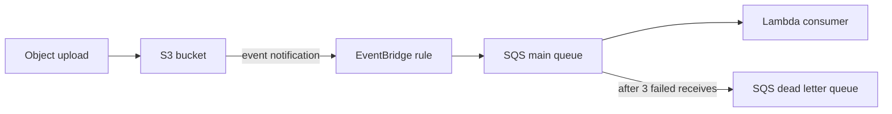

## Overview

You will build a decoupled event pipeline: an S3 upload emits an event to EventBridge, a rule routes it to an SQS queue, and a Python Lambda consumes the queue. A dead-letter queue catches messages that fail repeatedly, and you will **deliberately break the consumer** to watch retries and DLQ delivery happen — the failure-handling story that separates this lab from a hello-world integration.

- **Difficulty:** Intermediate
- **Estimated time:** 1.5–2 hours
- **Estimated cost:** Under $0.50. S3, EventBridge, SQS, and Lambda all bill per request; lab volumes are effectively free-tier noise.

Companion pattern: [Event-Driven Architecture](../../architectures/event-driven/).


Idle cost here is near zero, but tear down anyway — leftover EventBridge rules and event source mappings will silently fire on future S3 activity in your account and confuse later labs. Run the **Teardown** section and the final verification checks.


## Architecture



## Prerequisites

- AWS CLI v2 configured — see [Getting Started](../getting-started/).
- Region assumption: **us-east-1**.
- `python3` and `zip` available locally.

## Build steps

{}

### Create the queues with a redrive policy

The DLQ comes first so the main queue can reference it. `maxReceiveCount: 3` means a message that fails three receives moves to the DLQ.

```bash
ACCOUNT_ID=$(aws sts get-caller-identity --query Account --output text)

DLQ_URL=$(aws sqs create-queue --queue-name lab04-dlq \
  --query 'QueueUrl' --output text)
DLQ_ARN=$(aws sqs get-queue-attributes --queue-url $DLQ_URL \
  --attribute-names QueueArn --query 'Attributes.QueueArn' --output text)

Q_URL=$(aws sqs create-queue --queue-name lab04-main \
  --attributes "{
    \"VisibilityTimeout\": \"30\",
    \"RedrivePolicy\": \"{\\\"deadLetterTargetArn\\\":\\\"$DLQ_ARN\\\",\\\"maxReceiveCount\\\":\\\"3\\\"}\"
  }" --query 'QueueUrl' --output text)
Q_ARN=$(aws sqs get-queue-attributes --queue-url $Q_URL \
  --attribute-names QueueArn --query 'Attributes.QueueArn' --output text)
```

### Create the S3 bucket and enable EventBridge notifications

```bash
BUCKET=lab04-events-$ACCOUNT_ID
aws s3api create-bucket --bucket $BUCKET

aws s3api put-bucket-notification-configuration --bucket $BUCKET \
  --notification-configuration '{"EventBridgeConfiguration": {}}'
```

That one flag makes S3 send **all** object-level events for this bucket to the default EventBridge bus.

### Create the EventBridge rule targeting SQS

The pattern matches only `Object Created` events from this specific bucket. The queue policy authorizes EventBridge to send.

```bash
aws events put-rule --name lab04-s3-created \
  --event-pattern "{
    \"source\": [\"aws.s3\"],
    \"detail-type\": [\"Object Created\"],
    \"detail\": {\"bucket\": {\"name\": [\"$BUCKET\"]}}
  }"

RULE_ARN=$(aws events describe-rule --name lab04-s3-created \
  --query 'Arn' --output text)

aws sqs set-queue-attributes --queue-url $Q_URL --attributes "{
  \"Policy\": \"{\\\"Version\\\":\\\"2012-10-17\\\",\\\"Statement\\\":[{\\\"Effect\\\":\\\"Allow\\\",\\\"Principal\\\":{\\\"Service\\\":\\\"events.amazonaws.com\\\"},\\\"Action\\\":\\\"sqs:SendMessage\\\",\\\"Resource\\\":\\\"$Q_ARN\\\",\\\"Condition\\\":{\\\"ArnEquals\\\":{\\\"aws:SourceArn\\\":\\\"$RULE_ARN\\\"}}}]}\"
}"

aws events put-targets --rule lab04-s3-created \
  --targets "Id=lab04-sqs,Arn=$Q_ARN"
```

### Write the Lambda consumer with a poison-pill switch

The handler logs each object key — and **raises an exception if the key contains `poison`**. That is your controlled failure for the retry demonstration.

```bash
mkdir -p /tmp/lab04 && cd /tmp/lab04

cat > consumer.py <<'EOF'
import json

def handler(event, context):
    for record in event["Records"]:
        detail = json.loads(record["body"]).get("detail", {})
        key = detail.get("object", {}).get("key", "unknown")
        if "poison" in key:
            print(f"FAILING on purpose for key: {key}")
            raise RuntimeError(f"poison pill: {key}")
        print(f"Processed upload: {key}")
    return {"processed": len(event["Records"])}
EOF

zip consumer.zip consumer.py
```

### Deploy Lambda and connect it to the queue

```bash
aws iam create-role --role-name lab04-consumer-role \
  --assume-role-policy-document '{
    "Version": "2012-10-17",
    "Statement": [{
      "Effect": "Allow",
      "Principal": {"Service": "lambda.amazonaws.com"},
      "Action": "sts:AssumeRole"
    }]
  }'
aws iam attach-role-policy --role-name lab04-consumer-role \
  --policy-arn arn:aws:iam::aws:policy/service-role/AWSLambdaSQSQueueExecutionRole
sleep 10

aws lambda create-function --function-name lab04-consumer \
  --runtime python3.12 --handler consumer.handler \
  --zip-file fileb://consumer.zip \
  --role arn:aws:iam::$ACCOUNT_ID:role/lab04-consumer-role \
  --timeout 20
aws lambda wait function-active --function-name lab04-consumer

ESM_UUID=$(aws lambda create-event-source-mapping \
  --function-name lab04-consumer --event-source-arn $Q_ARN \
  --batch-size 1 --query 'UUID' --output text)
```

`--batch-size 1` keeps each message's fate independent, so the poison pill only poisons itself.

{}

## Verify

**Happy path.** Upload a normal file and watch it flow through:

```bash
echo "hello" > /tmp/ok.txt
aws s3 cp /tmp/ok.txt s3://$BUCKET/ok.txt
sleep 20
aws logs filter-log-events --log-group-name /aws/lambda/lab04-consumer \
  --filter-pattern "Processed" --query 'events[].message'
```

A log line `Processed upload: ok.txt` proves the full chain: S3 to EventBridge to SQS to Lambda.

**Failure path.** Upload a poison-pill object, then watch SQS retry it three times before the redrive policy moves it to the DLQ:

```bash
echo "bad" > /tmp/poison.txt
aws s3 cp /tmp/poison.txt s3://$BUCKET/poison-pill.txt
sleep 120
aws sqs get-queue-attributes --queue-url $DLQ_URL \
  --attribute-names ApproximateNumberOfMessages \
  --query 'Attributes.ApproximateNumberOfMessages'
```

The DLQ count reaching `1` — while `ok.txt` never appears there — is the success criterion. Inspect the failed message to confirm which object it was:

```bash
aws sqs receive-message --queue-url $DLQ_URL \
  --max-number-of-messages 1 --query 'Messages[0].Body'
```

You can also see the three failed attempts in the Lambda logs as repeated `FAILING on purpose` lines roughly 30 seconds apart — that spacing is the queue's visibility timeout driving the retry cadence.

## Capture your evidence

- CloudWatch Logs screenshot showing the three retry attempts for the poison message followed by silence — with the DLQ message count at 1 beside it.
- The EventBridge rule detail page showing the S3 event pattern and the SQS target.
- A terminal capture of the happy-path upload and its `Processed upload` log line, demonstrating end-to-end latency.

## Teardown

```bash
aws lambda delete-event-source-mapping --uuid $ESM_UUID
aws lambda delete-function --function-name lab04-consumer

aws events remove-targets --rule lab04-s3-created --ids lab04-sqs
aws events delete-rule --name lab04-s3-created

aws s3 rm s3://$BUCKET --recursive
aws s3api delete-bucket --bucket $BUCKET

aws sqs delete-queue --queue-url $Q_URL
aws sqs delete-queue --queue-url $DLQ_URL

aws iam detach-role-policy --role-name lab04-consumer-role \
  --policy-arn arn:aws:iam::aws:policy/service-role/AWSLambdaSQSQueueExecutionRole
aws iam delete-role --role-name lab04-consumer-role
```

Confirm nothing remains — all three should return empty:

```bash
aws sqs list-queues --queue-name-prefix lab04
aws events list-rules --name-prefix lab04 --query 'Rules'
aws s3api head-bucket --bucket $BUCKET 2>&1 | grep -c 404
```

## Resume bullet

> Engineered an event-driven processing pipeline on AWS using S3, EventBridge, SQS, and Lambda, implementing dead-letter queues and redrive policies to isolate poison messages and guarantee at-least-once processing with observable retry behavior.

See the [Career Toolkit](../../career/) for how to adapt this to your resume and LinkedIn.
