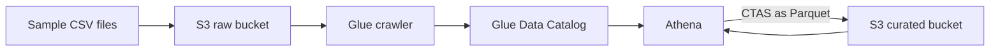

## Overview

You will stand up a minimal but genuine data lake: a raw S3 bucket with sample CSV data, a Glue crawler that infers the schema into the Data Catalog, Athena SQL over the raw data, and a CTAS query that writes a Parquet-formatted curated copy. The raw/curated split plus catalog plus serverless SQL is the core of nearly every AWS analytics architecture — and this lab has no servers at all.

- **Difficulty:** Beginner
- **Estimated time:** 1–1.5 hours
- **Estimated cost:** Under $0.50. Athena bills $5 per TB scanned — your sample data is kilobytes. One crawler run costs a few cents (10-minute DPU minimum), and S3 storage is negligible.

Companion pattern: [Data & Analytics Architecture](../../architectures/data-analytics/).


This lab is one of the cheapest on the site, but Glue crawlers configured on a schedule keep billing per run, and forgotten buckets accumulate storage cost. Tear down when finished and confirm the final checks return nothing.


## Architecture



## Prerequisites

- AWS CLI v2 configured — see [Getting Started](../getting-started/).
- Region assumption: **us-east-1**.
- No local tooling beyond the CLI — Athena and Glue are fully serverless.

## Build steps

{}

### Create the buckets and sample data

Three buckets: raw data, curated data, and Athena query results.

```bash
ACCOUNT_ID=$(aws sts get-caller-identity --query Account --output text)
RAW=lab05-raw-$ACCOUNT_ID
CURATED=lab05-curated-$ACCOUNT_ID
RESULTS=lab05-athena-results-$ACCOUNT_ID

aws s3 mb s3://$RAW
aws s3 mb s3://$CURATED
aws s3 mb s3://$RESULTS

cat > /tmp/orders.csv <<'EOF'
order_id,customer,region,amount,order_date
1001,acme,us-east,120.50,2026-06-01
1002,globex,eu-west,89.99,2026-06-01
1003,acme,us-east,340.00,2026-06-02
1004,initech,ap-south,15.25,2026-06-02
1005,globex,eu-west,220.10,2026-06-03
1006,initech,ap-south,410.75,2026-06-03
1007,acme,us-east,55.00,2026-06-04
1008,hooli,us-west,999.99,2026-06-04
EOF

aws s3 cp /tmp/orders.csv s3://$RAW/orders/orders.csv
```

The extra `orders/` prefix matters: the crawler names tables after the folder, not the file.

### Create the Glue crawler role

```bash
aws iam create-role --role-name lab05-glue-role \
  --assume-role-policy-document '{
    "Version": "2012-10-17",
    "Statement": [{
      "Effect": "Allow",
      "Principal": {"Service": "glue.amazonaws.com"},
      "Action": "sts:AssumeRole"
    }]
  }'
aws iam attach-role-policy --role-name lab05-glue-role \
  --policy-arn arn:aws:iam::aws:policy/service-role/AWSGlueServiceRole
aws iam put-role-policy --role-name lab05-glue-role \
  --policy-name lab05-s3-read \
  --policy-document "{
    \"Version\": \"2012-10-17\",
    \"Statement\": [{
      \"Effect\": \"Allow\",
      \"Action\": [\"s3:GetObject\", \"s3:ListBucket\"],
      \"Resource\": [\"arn:aws:s3:::$RAW\", \"arn:aws:s3:::$RAW/*\"]
    }]
  }"
sleep 10
```

### Create the database and run the crawler

```bash
aws glue create-database --database-input Name=lab05_datalake

aws glue create-crawler --name lab05-crawler \
  --role arn:aws:iam::$ACCOUNT_ID:role/lab05-glue-role \
  --database-name lab05_datalake \
  --targets "{\"S3Targets\": [{\"Path\": \"s3://$RAW/orders/\"}]}"

aws glue start-crawler --name lab05-crawler
```

Poll until the crawler finishes (typically 1–2 minutes):

```bash
aws glue get-crawler --name lab05-crawler \
  --query 'Crawler.State' --output text
```

When the state returns to `READY`, confirm the table exists with an inferred schema:

```bash
aws glue get-table --database-name lab05_datalake --name orders \
  --query 'Table.StorageDescriptor.Columns'
```

You should see five columns with types inferred from the CSV — `bigint`, `string`, and `double` among them.

### Query the raw data with Athena

```bash
QID=$(aws athena start-query-execution \
  --query-string "SELECT region, count(*) AS orders, sum(amount) AS revenue FROM lab05_datalake.orders GROUP BY region ORDER BY revenue DESC" \
  --result-configuration OutputLocation=s3://$RESULTS/ \
  --query 'QueryExecutionId' --output text)

sleep 10
aws athena get-query-results --query-execution-id $QID \
  --query 'ResultSet.Rows[].Data[].VarCharValue' --output text
```

### Create the curated Parquet table with CTAS

A single `CREATE TABLE AS SELECT` converts CSV to compressed, columnar Parquet — the standard raw-to-curated hop.

```bash
QID2=$(aws athena start-query-execution \
  --query-string "CREATE TABLE lab05_datalake.orders_curated WITH (format = 'PARQUET', parquet_compression = 'SNAPPY', external_location = 's3://$CURATED/orders/') AS SELECT order_id, customer, region, CAST(amount AS decimal(10,2)) AS amount, CAST(order_date AS date) AS order_date FROM lab05_datalake.orders" \
  --result-configuration OutputLocation=s3://$RESULTS/ \
  --query 'QueryExecutionId' --output text)

sleep 15
aws athena get-query-execution --query-execution-id $QID2 \
  --query 'QueryExecution.Status.State' --output text
```

{}

## Verify

Query the curated Parquet table and compare bytes scanned against the raw table:

```bash
QID3=$(aws athena start-query-execution \
  --query-string "SELECT customer, sum(amount) AS total FROM lab05_datalake.orders_curated GROUP BY customer ORDER BY total DESC" \
  --result-configuration OutputLocation=s3://$RESULTS/ \
  --query 'QueryExecutionId' --output text)

sleep 10
aws athena get-query-results --query-execution-id $QID3 \
  --query 'ResultSet.Rows[].Data[].VarCharValue' --output text

aws athena get-query-execution --query-execution-id $QID3 \
  --query 'QueryExecution.Statistics.DataScannedInBytes'
```

Success is the aggregation returning correct totals (hooli tops the list at 999.99) **from the Parquet copy**, and Parquet files physically present in the curated bucket:

```bash
aws s3 ls s3://$CURATED/orders/
```

At real data volumes the columnar format plus compression is what turns a $50 scan into a $2 scan — this lab shows the mechanism at toy scale.

## Capture your evidence

- The Athena console showing your GROUP BY query, its results, and the **Data scanned** figure — the cost-efficiency talking point.
- The Glue Data Catalog table page showing the crawler-inferred schema for `orders`.
- An S3 screenshot of the curated bucket containing Parquet objects next to the raw CSV bucket — the raw/curated zoning made visible.

## Teardown

```bash
aws glue delete-crawler --name lab05-crawler
aws glue delete-database --name lab05_datalake

aws s3 rb s3://$RAW --force
aws s3 rb s3://$CURATED --force
aws s3 rb s3://$RESULTS --force

aws iam delete-role-policy --role-name lab05-glue-role \
  --policy-name lab05-s3-read
aws iam detach-role-policy --role-name lab05-glue-role \
  --policy-arn arn:aws:iam::aws:policy/service-role/AWSGlueServiceRole
aws iam delete-role --role-name lab05-glue-role
```

Deleting the database removes both catalog tables with it. Confirm nothing remains:

```bash
aws glue get-databases --query "DatabaseList[?Name=='lab05_datalake']"
aws glue list-crawlers --query "CrawlerNames[?@=='lab05-crawler']"
aws s3 ls | grep lab05 || echo "no lab05 buckets remain"
```

## Resume bullet

> Built a serverless data lake on AWS with raw and curated S3 zones, automating schema discovery with Glue crawlers and the Data Catalog, and reducing Athena scan costs by converting CSV to partition-ready Parquet via CTAS.

See the [Career Toolkit](../../career/) for how to adapt this to your resume and LinkedIn.
