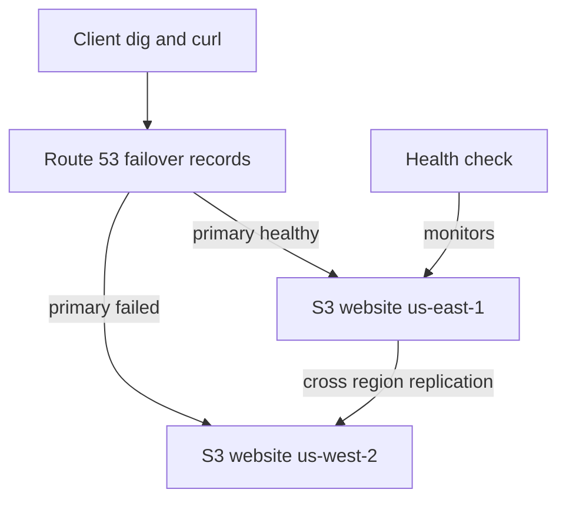

## Overview

You will build the smallest honest disaster-recovery setup on AWS: a static site in a primary region replicated to a standby region with S3 Cross-Region Replication, fronted by Route 53 failover routing driven by a health check. Then you will **break the primary on purpose** and measure how long it takes for DNS to fail over — turning "we have DR" from a claim into a number.

- **Difficulty:** Intermediate
- **Estimated time:** 1.5–2 hours
- **Estimated cost:** Under $1.50. The Route 53 health check (~$0.50/month, prorated) and hosted zone are the main items — and Route 53 does not charge for a hosted zone deleted within 12 hours. S3 storage and replication traffic for a few kilobytes are negligible.
- **You do not need to own a domain.** The lab creates a hosted zone for a placeholder name and verifies failover by querying that zone's name servers directly with `dig`.

Companion scenario: [High Availability & Disaster Recovery](../../scenarios/high-availability-dr/).


Health checks and hosted zones bill monthly, and this lab spans **two regions** — us-east-1 and us-west-2 — so teardown has two halves. Delete the hosted zone within 12 hours to avoid its charge, and run every command in the **Teardown** section.


## Architecture



## Prerequisites

- AWS CLI v2 configured — see [Getting Started](../getting-started/).
- Primary region **us-east-1**, standby region **us-west-2**.
- `dig` installed (part of bind-utils / dnsutils; preinstalled on macOS).

## Build steps

{}

### Create the primary and standby buckets

Bucket names are globally unique, so the two regions use different names. Versioning is required on both sides for replication.

```bash
ACCOUNT_ID=$(aws sts get-caller-identity --query Account --output text)
PRIMARY=lab06-primary-$ACCOUNT_ID
STANDBY=lab06-standby-$ACCOUNT_ID

aws s3api create-bucket --bucket $PRIMARY --region us-east-1
aws s3api create-bucket --bucket $STANDBY --region us-west-2 \
  --create-bucket-configuration LocationConstraint=us-west-2

aws s3api put-bucket-versioning --bucket $PRIMARY \
  --versioning-configuration Status=Enabled
aws s3api put-bucket-versioning --bucket $STANDBY \
  --versioning-configuration Status=Enabled
```

### Enable public static website hosting on both

Lab-only shortcut: public buckets keep the focus on failover mechanics. Production would put CloudFront with origin access control in front.

```bash
for B in $PRIMARY $STANDBY; do
  aws s3api put-public-access-block --bucket $B \
    --public-access-block-configuration \
    BlockPublicAcls=false,IgnorePublicAcls=false,BlockPublicPolicy=false,RestrictPublicBuckets=false
  aws s3api put-bucket-policy --bucket $B --policy "{
    \"Version\": \"2012-10-17\",
    \"Statement\": [{
      \"Effect\": \"Allow\",
      \"Principal\": \"*\",
      \"Action\": \"s3:GetObject\",
      \"Resource\": \"arn:aws:s3:::$B/*\"
    }]
  }"
  aws s3 website s3://$B/ --index-document index.html
done

PRIMARY_EP=$PRIMARY.s3-website-us-east-1.amazonaws.com
STANDBY_EP=$STANDBY.s3-website-us-west-2.amazonaws.com
```

### Configure cross-region replication

The replication role lets S3 read from the primary and write replicas to the standby. Delete markers are **not** replicated by default — which is exactly what makes the failure simulation work later.

```bash
aws iam create-role --role-name lab06-replication-role \
  --assume-role-policy-document '{
    "Version": "2012-10-17",
    "Statement": [{
      "Effect": "Allow",
      "Principal": {"Service": "s3.amazonaws.com"},
      "Action": "sts:AssumeRole"
    }]
  }'
aws iam put-role-policy --role-name lab06-replication-role \
  --policy-name lab06-replication \
  --policy-document "{
    \"Version\": \"2012-10-17\",
    \"Statement\": [
      {\"Effect\": \"Allow\",
       \"Action\": [\"s3:GetReplicationConfiguration\", \"s3:ListBucket\"],
       \"Resource\": \"arn:aws:s3:::$PRIMARY\"},
      {\"Effect\": \"Allow\",
       \"Action\": [\"s3:GetObjectVersionForReplication\", \"s3:GetObjectVersionAcl\", \"s3:GetObjectVersionTagging\"],
       \"Resource\": \"arn:aws:s3:::$PRIMARY/*\"},
      {\"Effect\": \"Allow\",
       \"Action\": [\"s3:ReplicateObject\", \"s3:ReplicateDelete\", \"s3:ReplicateTags\"],
       \"Resource\": \"arn:aws:s3:::$STANDBY/*\"}
    ]
  }"
sleep 10

aws s3api put-bucket-replication --bucket $PRIMARY \
  --replication-configuration "{
    \"Role\": \"arn:aws:iam::$ACCOUNT_ID:role/lab06-replication-role\",
    \"Rules\": [{
      \"ID\": \"lab06-crr\",
      \"Status\": \"Enabled\",
      \"Priority\": 1,
      \"Filter\": {},
      \"DeleteMarkerReplication\": {\"Status\": \"Disabled\"},
      \"Destination\": {\"Bucket\": \"arn:aws:s3:::$STANDBY\"}
    }]
  }"
```

### Upload content and confirm replication

The page identifies its region, so you can always tell which site answered.

```bash
echo "<h1>Lab 6 DR site</h1><p>Region: us-east-1 PRIMARY</p>" > /tmp/index.html
aws s3 cp /tmp/index.html s3://$PRIMARY/index.html \
  --content-type text/html

sleep 60
aws s3api head-object --bucket $STANDBY --key index.html \
  --query 'ReplicationStatus'
```

Wait until the replica exists, then overwrite the standby copy so the region label is honest (replication is one-way, so this local edit is safe):

```bash
echo "<h1>Lab 6 DR site</h1><p>Region: us-west-2 STANDBY</p>" > /tmp/index.html
aws s3 cp /tmp/index.html s3://$STANDBY/index.html \
  --content-type text/html
```

### Create the health check on the primary endpoint

A 10-second interval with a failure threshold of 3 gives detection in roughly 30–40 seconds.

```bash
HC_ID=$(aws route53 create-health-check \
  --caller-reference lab06-$(date +%s) \
  --health-check-config "{
    \"Type\": \"HTTP\",
    \"FullyQualifiedDomainName\": \"$PRIMARY_EP\",
    \"Port\": 80,
    \"ResourcePath\": \"/index.html\",
    \"RequestInterval\": 10,
    \"FailureThreshold\": 3
  }" --query 'HealthCheck.Id' --output text)
```

### Create the hosted zone and failover records

The zone uses a placeholder name — we will query its name servers directly, so no registration is needed.

```bash
ZONE_ID=$(aws route53 create-hosted-zone --name lab06-dr.example.com \
  --caller-reference lab06-$(date +%s) \
  --query 'HostedZone.Id' --output text)

aws route53 change-resource-record-sets --hosted-zone-id $ZONE_ID \
  --change-batch "{
    \"Changes\": [
      {\"Action\": \"CREATE\", \"ResourceRecordSet\": {
        \"Name\": \"www.lab06-dr.example.com\", \"Type\": \"CNAME\", \"TTL\": 30,
        \"SetIdentifier\": \"primary\", \"Failover\": \"PRIMARY\",
        \"HealthCheckId\": \"$HC_ID\",
        \"ResourceRecords\": [{\"Value\": \"$PRIMARY_EP\"}]
      }},
      {\"Action\": \"CREATE\", \"ResourceRecordSet\": {
        \"Name\": \"www.lab06-dr.example.com\", \"Type\": \"CNAME\", \"TTL\": 30,
        \"SetIdentifier\": \"secondary\", \"Failover\": \"SECONDARY\",
        \"ResourceRecords\": [{\"Value\": \"$STANDBY_EP\"}]
      }}
    ]
  }"

NS=$(aws route53 get-hosted-zone --id $ZONE_ID \
  --query 'DelegationSet.NameServers[0]' --output text)
echo "Zone name server: $NS"
```

{}

## Verify

**Steady state.** Both endpoints serve, and DNS answers with the primary:

```bash
curl -s http://$PRIMARY_EP/ | grep Region
curl -s http://$STANDBY_EP/ | grep Region

aws route53 get-health-check-status --health-check-id $HC_ID \
  --query 'HealthCheckObservations[0].StatusReport.Status'

dig +short @$NS www.lab06-dr.example.com CNAME
```

The `dig` answer must be the **primary** endpoint while the health check reports success.

**Trigger the disaster.** Delete the primary's index page. The delete marker is not replicated, so the standby keeps serving:

```bash
aws s3 rm s3://$PRIMARY/index.html

date
while true; do
  ANSWER=$(dig +short @$NS www.lab06-dr.example.com CNAME)
  echo "$(date +%T)  $ANSWER"
  [[ "$ANSWER" == "$STANDBY_EP." ]] && break
  sleep 10
done
```

Success is the loop output flipping from the primary endpoint to the standby endpoint. With a 10-second interval and threshold of 3, expect the flip within **30–90 seconds** of the delete — that measured window is your recovery time objective for DNS-layer failover. Confirm the standby actually serves:

```bash
curl -s http://$STANDBY_EP/ | grep STANDBY
```

Optional recovery test: re-upload `index.html` to the primary and watch the same loop flip back once the health check turns healthy.

## Capture your evidence

- The timestamped `dig` loop output showing the exact moment DNS flipped to the standby — a measured failover time is rare and memorable portfolio material.
- The Route 53 health check page showing the status change from healthy to unhealthy with its monitoring graph.
- The S3 replication configuration and the standby bucket serving content from us-west-2 while the primary object is deleted.

## Teardown

Two regions, so read carefully. Delete the hosted zone within 12 hours to avoid its monthly charge.

```bash
aws route53 change-resource-record-sets --hosted-zone-id $ZONE_ID \
  --change-batch "{
    \"Changes\": [
      {\"Action\": \"DELETE\", \"ResourceRecordSet\": {
        \"Name\": \"www.lab06-dr.example.com\", \"Type\": \"CNAME\", \"TTL\": 30,
        \"SetIdentifier\": \"primary\", \"Failover\": \"PRIMARY\",
        \"HealthCheckId\": \"$HC_ID\",
        \"ResourceRecords\": [{\"Value\": \"$PRIMARY_EP\"}]
      }},
      {\"Action\": \"DELETE\", \"ResourceRecordSet\": {
        \"Name\": \"www.lab06-dr.example.com\", \"Type\": \"CNAME\", \"TTL\": 30,
        \"SetIdentifier\": \"secondary\", \"Failover\": \"SECONDARY\",
        \"ResourceRecords\": [{\"Value\": \"$STANDBY_EP\"}]
      }}
    ]
  }"
aws route53 delete-hosted-zone --id $ZONE_ID
aws route53 delete-health-check --health-check-id $HC_ID

aws s3api delete-bucket-replication --bucket $PRIMARY

aws s3api delete-objects --bucket $PRIMARY --delete "$(
  aws s3api list-object-versions --bucket $PRIMARY \
    --query '{Objects: [Versions[].{Key: Key, VersionId: VersionId}, DeleteMarkers[].{Key: Key, VersionId: VersionId}][]}' \
    --output json)"
aws s3api delete-bucket --bucket $PRIMARY

aws s3api delete-objects --bucket $STANDBY --delete "$(
  aws s3api list-object-versions --bucket $STANDBY \
    --query '{Objects: [Versions[].{Key: Key, VersionId: VersionId}, DeleteMarkers[].{Key: Key, VersionId: VersionId}][]}' \
    --output json)" --region us-west-2
aws s3api delete-bucket --bucket $STANDBY --region us-west-2

aws iam delete-role-policy --role-name lab06-replication-role \
  --policy-name lab06-replication
aws iam delete-role --role-name lab06-replication-role
```

Versioned buckets require deleting every object **version** before the bucket itself, hence the `list-object-versions` dance. Confirm nothing billable remains:

```bash
aws route53 list-hosted-zones \
  --query "HostedZones[?contains(Name, 'lab06')]"
aws route53 list-health-checks \
  --query "HealthChecks[?Id=='$HC_ID']"
aws s3 ls | grep lab06 || echo "no lab06 buckets remain"
```

## Resume bullet

> Implemented cross-region disaster recovery on AWS using S3 Cross-Region Replication and Route 53 health-check failover routing, then validated the design with a live failure injection that measured DNS failover completing in under 90 seconds.

See the [Career Toolkit](../../career/) for how to adapt this to your resume and LinkedIn.
