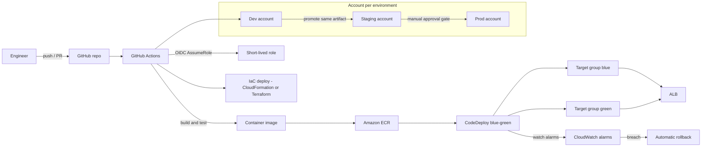

## The scenario

A 40-engineer product company deploys its ECS-based platform twice a month, each release a two-hour evening event with a manual runbook, hand-edited task definitions, and a rollback plan that amounts to "redeploy the old image and hope." Two of the last six releases caused customer-visible incidents. Engineering leadership wants **daily deployments with zero-downtime releases, automatic rollback, and no human touching production credentials** — and the security team adds: no long-lived AWS access keys in any CI system.

## Requirements breakdown

- **Deploy daily, safely** — every merge to main should be deployable through an automated path; no manual runbooks.
- **Zero-downtime releases** — traffic shifts to new versions gradually; users never see an outage window.
- **Automatic rollback** — a bad release is detected by alarms and reverted without a 2 a.m. decision meeting.
- **No long-lived credentials in CI** — the pipeline authenticates to AWS with short-lived, scoped credentials.
- **Environment promotion** — changes flow dev → staging → prod with the same artifact, gated where the business requires it.
- **Infrastructure changes ride the same discipline** — IaC goes through review and pipeline, not console edits.

## Recommended design

## Solution walkthrough

- **GitHub Actions with OIDC federation** replaces stored access keys entirely. The workflow requests a short-lived token from GitHub's OIDC provider and assumes a scoped IAM role via `aws-actions/configure-aws-credentials`; the role's trust policy pins the exact repository and branch. This satisfies the security requirement with zero secret rotation burden — there is nothing to leak.
- **Build once, promote the same artifact.** CI builds the container image once, tags it with the commit SHA, and pushes to **ECR**. Dev, staging, and prod all deploy that same immutable image — what was tested is what ships. Environment differences live in configuration (SSM Parameter Store, task definition overrides), never in rebuilt images.
- **CodeDeploy blue/green on ECS** handles the zero-downtime requirement. A new task set spins up behind a second target group, a canary or linear traffic shift moves users over (for example 10% for five minutes, then the rest), and the old task set stays warm for instant rollback until the bake window passes.
- **CloudWatch alarms drive automatic rollback.** The deployment group watches 5xx rate, latency, and application health alarms during the shift; a breach reverts traffic to blue in seconds without human intervention. This turns "rollback plan" from a document into a property of the system.
- **Multi-account promotion** follows the [multi-account landing zone](../../architectures/multi-account) pattern: each environment is its own account, CI assumes a distinct role per account, and prod deployment requires a **manual approval gate** (a GitHub environment protection rule or CodePipeline approval action) — the one deliberate human step retained, for change-management sign-off rather than mechanics.
- **IaC in the same pipeline.** CloudFormation or Terraform changes go through plan-on-PR (the diff is reviewed alongside the code) and apply-on-merge. Nobody edits infrastructure in the console; drift detection flags anything that bypasses the pipeline.


The AWS-native alternative — CodePipeline with CodeBuild and CodeDeploy — implements the same shape entirely inside AWS. Choose based on where your source and team workflows already live; the architecture principles (OIDC or no static keys, immutable artifacts, alarm-gated traffic shifting) transfer unchanged.


## Options compared

| Approach | Deployment safety | Cost | Complexity | When it fits |
|---|---|---|---|---|
| GitHub Actions + OIDC + CodeDeploy blue-green (this design) | Canary shifts, alarm-gated auto rollback | Low - pay per build minute | Medium | Source already on GitHub; team wants one CI system |
| CodePipeline + CodeBuild + CodeDeploy | Same rollback safety, native approvals and CloudTrail audit | Low | Medium | AWS-centric shops, strict audit requirements, CodeCommit or S3 sources |
| Jenkins on EC2 pushing with stored keys | Whatever you script; rollback is manual unless built | Medium - always-on instances | High - you operate the CI itself | Legacy investment only; migrate away — stored keys and self-managed CI are the two costs this scenario exists to remove |

The deployment strategy is a second axis: **rolling updates** are simplest but mix old and new versions with no fast rollback; **blue/green** gives instant traffic swap at the cost of double capacity during deploys; **canary** adds progressive exposure on top of blue/green. For Lambda-based stacks the same progression exists natively with CodeDeploy's `Linear` and `Canary` alias-shifting configurations.

## Pitfalls seen in real projects

- **Rebuilding the image per environment.** "It passed staging" means nothing if prod rebuilds from source with different dependency resolution. Build once, promote by digest, and pin base images.
- **OIDC trust policies that are too broad.** A trust policy with `repo:org/*` lets any repository in the organization assume the deploy role. Pin the exact repo, and pin branch or environment claims for the prod role.
- **Blue/green without meaningful alarms.** Traffic shifts gated on alarms that never fire (or fire on noise) give either false confidence or constant rollbacks. Invest in the health signal — synthetic canaries on the green target group before shifting real users.
- **Database migrations coupled to deployments.** Blue and green run simultaneously during the shift, so schema changes must be backward-compatible for at least one version. Expand-migrate-contract, never drop-and-replace in the same release.
- **The pipeline itself becoming the outage.** A deploy role deleted, a runner queue backed up on launch day, an expired GitHub App token — treat the pipeline as production infrastructure with its own alarms and a documented break-glass deploy path.
- **Approval gates everywhere.** If staging, pre-prod, and prod all require a director's click, daily deployment dies in the queue. Keep exactly one human gate, at prod, and make everything before it fully automatic.

## How to talk about this in an interview

"I moved a team from bi-weekly manual releases to daily automated deployments. The pipeline was GitHub Actions federating into AWS with OIDC — no stored keys anywhere — building an immutable image per commit and promoting that same artifact through per-account dev, staging, and prod environments. Releases were CodeDeploy blue/green on ECS with a canary traffic shift gated by CloudWatch alarms, so a bad release rolled itself back before most users saw it. The trade-off discussion I lead with is deployment strategy: rolling is cheapest, blue/green costs double capacity during the shift but buys instant rollback, and we judged that cost worth it for a customer-facing API. The cultural change — one approval gate instead of five — mattered as much as the architecture."

## Related content

- Architecture reference: [Microservices on ECS](../../architectures/microservices) — the workload this pipeline deploys; [Multi-Account Landing Zone](../../architectures/multi-account) — the account structure the promotion flow rides on.
- Related playbook: [Security & Compliance](security-compliance) — CloudTrail and least-privilege patterns that make pipeline actions auditable.
- Build it: [Lab 03 — Microservices on ECS Fargate](../../labs/lab-03-microservices-ecs) builds the ECS service this scenario automates; this site itself deploys via GitHub Actions ([workflow source](https://github.com/jeonck/aws-sol-lab/blob/main/.github/workflows/deploy.yml)) as a minimal working example.
