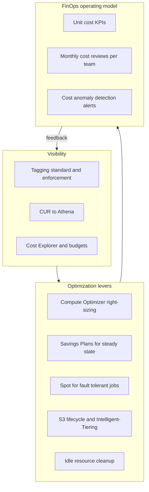

## The scenario

A SaaS company's AWS bill has grown from $40k to $180k per month in eighteen months, and the CFO wants a **30% reduction within two quarters** — without a reliability regression, and without freezing feature delivery. Nobody can say which product line drives the spend, and the last "cost project" died when engineering treated it as someone else's problem.

## Requirements breakdown

- **30% reduction in two quarters** — needs quick wins (commitments, storage lifecycle) layered with structural fixes (right-sizing, architecture).
- **Attribution before action** — spend must be mapped to teams and products, or savings cannot be targeted or sustained.
- **No reliability regression** — Spot and downsizing must respect workload criticality; savings that cause outages cost more than they save.
- **Sustainable, not one-off** — an operating model with owners and reviews, so the bill does not creep back.

## Recommended design

## Solution walkthrough

- **Visibility first.** A mandatory tagging standard (owner, product, environment, cost-center) is enforced with tag policies and an SCP-backed "no tag, no deploy" rule for new resources. The **Cost and Usage Report**(CUR) lands in S3 and is queried with Athena for questions Cost Explorer cannot answer; Cost Explorer plus AWS Budgets handles the day-to-day. Two to three weeks of attribution work reveals the real targets — typically a handful of services and one team driving half the growth.
- **Right-size before committing.** **Compute Optimizer** recommendations (backed by CloudWatch utilization) drive a downsizing pass across EC2, EBS, and Lambda. This ordering matters: buying Savings Plans against oversized instances locks in the waste.
- **Commitment strategy.** After right-sizing, cover the steady-state baseline with **Compute Savings Plans** — they flex across instance family, Region, and Fargate/Lambda, which suits a changing SaaS platform better than standard RIs. RIs stay relevant for RDS, ElastiCache, and OpenSearch, where Savings Plans do not apply. Target roughly 70–80% coverage of the post-right-sizing baseline; chasing 100% coverage guarantees paying for unused commitment.
- **Spot for the right workloads.** CI runners, batch analytics, and stateless dev environments move to Spot with mixed-instance Auto Scaling groups (multiple families and AZs, capacity-optimized allocation). Production databases and the customer-facing critical path do not.
- **Storage hygiene.** S3 analysis shows years of logs in Standard: lifecycle rules transition logs to Glacier tiers and expire temp data, while unpredictable-access buckets switch to **Intelligent-Tiering**. Unattached EBS volumes, aged snapshots, and idle load balancers are deleted on a recurring schedule, not once.
- **FinOps operating model.** Each team gets a unit-cost KPI (cost per tenant, per 1k requests), a monthly 30-minute cost review, and Cost Anomaly Detection alerts routed to their own channel. Engineering owns its spend; the FinOps function provides data, tooling, and rate optimization centrally.


Order of operations matters: visibility, then right-sizing and cleanup, then commitments. Commitments purchased first freeze inefficiency at a discount.


## Options compared

| Lever | Typical savings | Risk | Effort | Flexibility |
|---|---|---|---|---|
| Compute Savings Plans | Up to ~66% vs on-demand | Low if sized to baseline | Low | High — spans family, Region, Fargate, Lambda |
| Standard RIs (RDS, etc.) | Up to ~70%+ | Medium — locked to instance attributes | Low | Low |
| Spot Instances | Up to ~90% | Interruption — needs fault-tolerant design | Medium | High for stateless work |
| Right-sizing + cleanup | 10–30% of compute/storage | Low with utilization data | Medium, recurring | n/a |

The 30% target is realistically assembled from stacked levers: right-sizing and idle cleanup (~10%), Savings Plans on the corrected baseline (~15% of total), storage lifecycle (~3–5%), and Spot on eligible workloads (the remainder).

## Pitfalls seen in real projects

- **Buying commitments before right-sizing.** The most common sequencing error — a three-year commitment on instances that were 4x oversized. Right-size first, commit second.
- **100% Savings Plan coverage.** Usage dips or an architecture change strands the commitment. Cover the floor, not the average.
- **Spot without interruption handling.** A team moves a stateful service to Spot, an interruption wave hits, and the postmortem kills Spot adoption company-wide. Start with unambiguously fault-tolerant workloads and prove the pattern.
- **Tagging as a spreadsheet exercise.** Tags defined but never enforced decay within a quarter. Enforce at deploy time via IaC validation and tag policies, and backfill with automation.
- **One-time project, no operating model.** The bill drops 30% and creeps back in a year because nobody owns it. The monthly review and unit-cost KPI are the actual deliverables; the savings are a side effect.

## How to talk about this in an interview

"I led a cost program that cut a $180k monthly AWS bill by roughly a third without a reliability regression. The sequencing was the key decision: tagging and CUR-based attribution first, then Compute Optimizer-driven right-sizing and idle cleanup, and only then Savings Plans sized to about 75% of the corrected baseline — because committing before right-sizing locks in waste. We layered Spot onto CI and batch with mixed-instance groups, added S3 lifecycle policies, and made it stick with a FinOps operating model: unit-cost KPIs per team, monthly reviews, and anomaly alerts routed to the owning team rather than a central inbox."

## Related content

- Architecture reference: [Serverless](../../architectures/serverless) and [Event-Driven](../../architectures/event-driven) — architectures that convert idle capacity into per-request cost.
- Related playbook: right-sizing after lift-and-shift is covered in the [Migration playbook](migration).
- Build it: every lab in the [labs index](../../labs/) ends with a teardown step — the same discipline this playbook institutionalizes.
