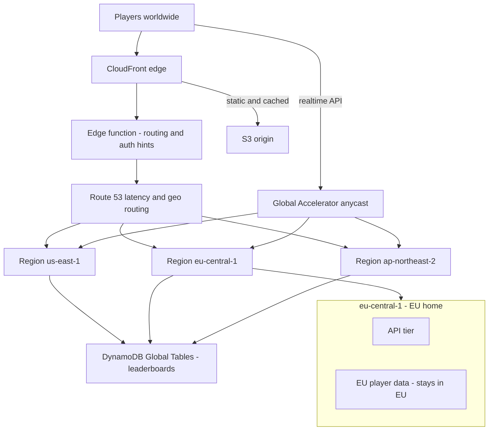

## The scenario

A gaming company's companion web platform — profiles, leaderboards, store — is hosted in `us-east-1` and is expanding launches to Europe and Asia-Pacific. Players in Seoul and Frankfurt see 250–400 ms API latency and complain loudly. The business wants **sub-100 ms perceived latency on three continents**, and legal adds a constraint: EU player personal data must stay in the EU.

## Requirements breakdown

- **Sub-100 ms perceived latency globally** — static and cacheable content must serve from the edge; dynamic APIs need Regional presence or accelerated routing.
- **EU data residency** — EU personal data is stored and processed in an EU Region; routing must guarantee EU users land there.
- **Global consistency where needed** — leaderboards are shared worldwide; profiles are per-player and can be Region-homed.
- **Launch-day traffic spikes** — the design must absorb 20x spikes without pre-warming heroics.
- **Operational simplicity** — a three-Region footprint must not triple the operational burden.

## Recommended design

## Solution walkthrough

- **CloudFront** serves the static shell, assets, and cacheable API responses (public leaderboard pages with short TTLs) from 600+ edge locations, eliminating the ocean crossing for most requests. Origin Shield reduces origin load during launch spikes.
- **Edge functions** handle logic that benefits from running before the request crosses the ocean: **CloudFront Functions** for lightweight header normalization and redirects, **Lambda@Edge** for heavier work like signed-cookie validation and injecting a data-residency routing hint based on the viewer's geolocation.
- **Global Accelerator** fronts the real-time, non-cacheable API paths (matchmaking status, store checkout) with two static anycast IPs. Player traffic enters the AWS backbone at the nearest edge instead of riding the public internet, typically cutting first-byte latency and jitter — and its instant Regional failover doubles as a resilience layer that does not wait for DNS TTLs.
- **Three Regional stacks** run the same infrastructure as code in `us-east-1`, `eu-central-1`, and `ap-northeast-2`. **Route 53 latency-based routing** sends users to the fastest healthy Region by default, but a **geolocation rule for EU countries** overrides latency and pins EU users to `eu-central-1` — residency beats speed.
- **Data layer, split by access pattern.** Leaderboards and game metadata live in **DynamoDB Global Tables**, replicated to all three Regions with local read/write latency and last-writer-wins conflict resolution — acceptable for score upserts. EU player personal data lives *only* in `eu-central-1` (Aurora plus a non-replicated DynamoDB table); it is deliberately excluded from global replication, which is the technical enforcement of the legal requirement.
- **One deployment pipeline, three targets.** Identical stacks per Region via IaC, deployed in waves with automatic rollback, keep three Regions from becoming three snowflakes.


Multi-Region writes are the hard part. Global Tables use last-writer-wins — fine for leaderboard scores, dangerous for wallets and inventory. Keep strongly consistent, money-adjacent data single-Region-homed with a clear owner Region per record.


## Options compared

| Approach | Latency result | Cost | Complexity | When it fits |
|---|---|---|---|---|
| Single Region + CloudFront | Great for static; API still crosses oceans | Low | Low | Content-heavy sites, modest API needs |
| Single Region + Global Accelerator | Better API latency and jitter; physics still caps far-user latency | Low-medium | Low | Real-time APIs, one Region, global users |
| Multi-Region active-active (this design) | Local latency everywhere | High | High | Latency SLOs plus residency requirements — this scenario |

If the requirement had been latency alone, CloudFront plus Global Accelerator on a single Region would be the pragmatic answer. The EU residency requirement independently forces an EU Region, and once a second Region exists, going active-active for latency is incremental rather than exotic.

## Pitfalls seen in real projects

- **Treating multi-Region as a copy-paste of Region one.** Manual tweaks accumulate, Regions drift, and a deploy that works in `us-east-1` fails in Seoul. Everything through IaC, no console changes, drift detection on.
- **Global Tables holding data that should not be global.** A table designed for leaderboards quietly accumulates PII attributes, and suddenly EU personal data is replicating to three continents. Enforce data classification at the schema level and audit replicated tables.
- **Latency-based routing surprising the residency lawyers.** An EU user on a VPN or an odd resolver path lands in `us-east-1`. Enforce residency in the application layer too — reject or redirect EU-tagged accounts that arrive at the wrong Region; never rely on DNS alone.
- **Cache invalidation as an afterthought.** A store price change goes out, CloudFront serves the old price for an hour, and support melts down. Design cache keys and TTLs per path from day one, and use versioned asset URLs instead of invalidations.
- **Ignoring inter-Region data transfer cost.** Global Tables replication and cross-Region chatter show up as a startling line item at scale. Model replication write units and transfer costs before choosing what replicates.

## How to talk about this in an interview

"I designed a three-continent architecture for a consumer platform with a sub-100 ms latency target and an EU data-residency constraint. CloudFront with edge functions handled the cacheable layer, Global Accelerator carried the real-time API traffic onto the AWS backbone, and three identical Regional stacks sat behind Route 53 latency-based routing — with a geolocation override pinning EU users to Frankfurt, because residency beats speed. The judgment call I highlight is the data split: leaderboards on DynamoDB Global Tables where last-writer-wins is acceptable, but personal and money-adjacent data Region-homed and excluded from replication, enforced in the application layer rather than trusting DNS."

## Related content

- Architecture reference: [Serverless](../../architectures/serverless) and [Event-Driven](../../architectures/event-driven) — common building blocks for the Regional stacks; [Microservices](../../architectures/microservices) for the API tier.
- Related playbook: the failover half of this design is covered in depth in [High Availability & DR](high-availability-dr).
- Build it: [Lab 06 — DR Failover](../../labs/lab-06-dr-failover) exercises the Route 53 routing policies used here.
