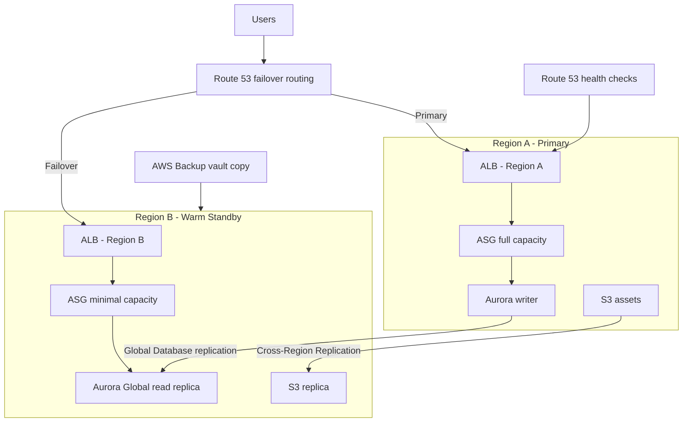

## The scenario

A regional insurance company runs its policy management platform in a single AWS Region. After a competitor suffered a well-publicized day-long outage, the board mandates that the platform must survive a full Region failure with **no more than 15 minutes of downtime**(RTO) and **no more than 1 minute of data loss**(RPO). The budget allows for standby infrastructure, but not for doubling the AWS bill.

## Requirements breakdown

- **RTO of 15 minutes** — recovery must be mostly automated; manual runbooks alone will not hit this target.
- **RPO of 1 minute** — data replication must be continuous, not snapshot-based; this rules out backup-and-restore as the primary strategy.
- **Cost ceiling below 2x** — multi-site active-active is likely over-budget; a scaled-down standby is the sweet spot.
- **Within-Region HA still required** — Multi-AZ is the baseline; DR is layered on top, not a substitute.
- **Provable recovery** — the design must support regular game-day failover tests without customer impact.

## Recommended design

## Solution walkthrough

- **Route 53 failover routing** with health checks against the primary ALB detects a Region-level failure and shifts traffic to the standby Region. With aggressive health check intervals and low TTLs, detection-to-failover lands in single-digit minutes.
- **Aurora Global Database** replicates with typical lag under one second, satisfying the 1-minute RPO. Promoting the secondary Region to writer takes about a minute, well inside the RTO window.
- **Warm standby compute** runs the full application stack in Region B at minimal capacity (for example, 2 instances instead of 20). On failover, the Auto Scaling group scales out while early traffic is already being served — degraded but up, which is what RTO measures.
- **S3 Cross-Region Replication**(CRR) keeps static assets and document storage current in the standby Region.
- **AWS Backup** with cross-Region vault copies remains the safety net for logical corruption — replication faithfully copies a bad deploy or a ransomware event, so point-in-time backups are still mandatory.


Replication is not backup. Aurora Global Database and S3 CRR protect against infrastructure loss, but they replicate deletions and corruption within seconds. Always pair replication with point-in-time backups in AWS Backup.


## Options compared

| Strategy | RTO | RPO | Relative cost | Complexity | When it fits |
|---|---|---|---|---|---|
| Backup & restore | Hours | Hours (last backup) | Very low | Low | Non-critical workloads, dev/test |
| Pilot light | 10 min – 1 hr | Seconds – minutes | Low | Medium | Data replicated live, compute provisioned on demand |
| Warm standby | Minutes | Seconds | Medium (~1.2–1.5x) | Medium-high | This scenario: tight RTO, constrained budget |
| Multi-site active-active | Near zero | Near zero | High (~2x+) | High | Payments, trading, anything where minutes cost millions |

The client's 15-minute RTO eliminates backup-and-restore. Pilot light is borderline — provisioning and warming compute under pressure often blows the window. Active-active exceeds the budget and adds multi-Region write complexity the workload does not need. **Warm standby** is the defensible middle.

## Pitfalls seen in real projects

- **Untested failover is fiction.** Teams discover on game day that the standby AMIs are six months stale, IAM roles are missing in Region B, or a hardcoded Region string breaks the app. Schedule quarterly failover drills and treat failures as findings, not embarrassments.
- **DNS TTLs sabotage the RTO.** A 24-hour TTL set years ago means clients keep resolving to the dead Region. Audit TTLs on every record in the failover path and keep them at 60 seconds or less.
- **Forgotten dependencies stay single-Region.** The app fails over cleanly, but the license server, an SES sending identity, or a third-party IP allowlist only exists in Region A. Inventory *every* dependency, not just the ones in the architecture diagram.
- **Quotas differ per Region.** The standby Region has default service quotas that cannot absorb production scale-out. Pre-raise EC2, EIP, and database quotas in the DR Region.
- **Failback is never designed.** Getting to Region B is half the job; reversing replication direction and returning to Region A without data loss needs its own runbook.

## How to talk about this in an interview

"I designed a warm-standby DR architecture for a workload with a 15-minute RTO and 1-minute RPO. I used Route 53 health-check failover in front of two Regions, Aurora Global Database for sub-second data replication, and S3 CRR for assets, with AWS Backup cross-Region copies as protection against logical corruption. The key decision was rejecting active-active — the RTO didn't justify 2x cost and multi-Region write complexity — and I validated the design with quarterly failover game days, which surfaced stale AMIs and a missing quota increase before a real incident could."

## Related content

- Build it: [Lab 06 — DR Failover](../../labs/lab-06-dr-failover) puts this exact failover pattern into practice.
- Foundation: [Lab 01 — Three-Tier Web](../../labs/lab-01-three-tier-web) covers the Multi-AZ baseline that DR builds on.
- Architecture reference: [Three-Tier Web](../../architectures/three-tier-web) and [Multi-Account](../../architectures/multi-account).
