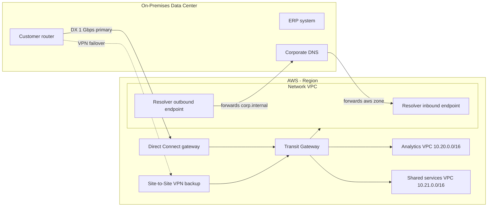

## The scenario

A manufacturing company is moving analytics workloads to AWS but must keep its ERP system on-premises for at least three years. Factory applications in the data center need private, low-latency access to services in AWS, and AWS workloads need to resolve internal DNS names like `erp.corp.internal`. The network team demands predictable bandwidth for nightly data transfers of roughly 2 TB.

## Requirements breakdown

- **Private connectivity** — no traffic over the public internet; corporate security policy requires private IP paths end to end.
- **Predictable bandwidth** — 2 TB nightly transfers need consistent throughput; internet-based VPN performance varies too much.
- **Bidirectional DNS** — on-premises hosts resolve AWS private zones, and AWS workloads resolve corporate DNS.
- **Room to grow** — more VPCs will arrive as teams migrate; the design must not require re-plumbing per VPC.
- **No IP conflicts** — VPC CIDRs must be planned against existing corporate ranges before anything is built.

## Recommended design

## Solution walkthrough

- **Direct Connect as primary path.** A 1 Gbps dedicated connection delivers the consistent throughput the nightly 2 TB transfer needs (2 TB over 8 hours requires roughly 560 Mbps sustained). A **Site-to-Site VPN**over the internet serves as failover — cheaper than a second DX circuit and acceptable because degraded nightly transfer is tolerable, while total disconnection is not. BGP routing prefers DX and fails over automatically.
- **Transit Gateway as the hub.** Instead of terminating the hybrid connection into one VPC and peering outward, all VPCs attach to a Transit Gateway. New VPCs join with one attachment and a route table entry — no per-VPC VPN or peering mesh.
- **Route 53 Resolver endpoints** handle hybrid DNS. The **inbound endpoint** gives corporate DNS servers an IP target inside AWS to forward queries for private hosted zones. The **outbound endpoint** with forwarding rules sends queries for `corp.internal` from any VPC back to corporate DNS. Rules are shared across VPCs via AWS Resource Access Manager.
- **IP planning up front.** The corporate network uses `10.0.0.0/12`, so AWS VPCs are carved from `10.16.0.0/12` with a /16 per VPC and /20 subnets per AZ tier. Documenting this allocation plan before the first VPC exists is what prevents the un-fixable overlap problem later.


Direct Connect alone is not encrypted. If policy requires encryption in transit over the private circuit, run a VPN over the Direct Connect connection or use MACsec on 10 Gbps+ dedicated connections.


## Options compared

| Approach | Bandwidth | Latency | Monthly cost | Lead time | When it fits |
|---|---|---|---|---|---|
| Site-to-Site VPN only | Up to ~1.25 Gbps per tunnel, variable | Internet-dependent | Low (~$36/tunnel + data) | Hours | Pilots, low-volume, failover path |
| Direct Connect + VPN backup | Consistent 1–100 Gbps | Consistent, low | Medium (port + data out) | Weeks to months | This scenario: predictable bulk transfer |
| Dual Direct Connect (resilient) | Consistent, redundant | Consistent, low | High | Months | Regulated workloads where VPN failover is unacceptable |

VPN-only fails the predictable-bandwidth requirement. Dual DX doubles circuit cost for a resilience level the business did not ask for. **DX with VPN backup** matches both the throughput requirement and the budget.

## Pitfalls seen in real projects

- **Overlapping CIDRs discovered after workloads deploy.** The single most expensive hybrid mistake. Re-IPing a live VPC effectively means rebuilding it. Reserve AWS ranges in the corporate IPAM on day one.
- **Direct Connect lead time surprises the project plan.** Circuit delivery through a colocation partner routinely takes 4–12 weeks. Order DX early and run VPN in the interim.
- **DNS forwarding loops.** Corporate DNS forwards `aws.corp.internal` to the inbound endpoint, and an over-broad outbound rule forwards it right back. Keep forwarding rules narrowly scoped and never forward a zone to both sides.
- **Transit Gateway route table sprawl.** Teams start with the default route table associating everything with everything, then discover VPC-to-VPC paths that security never approved. Design segmented TGW route tables (prod, non-prod, shared) from the start.
- **Testing failover only at the tunnel level.** BGP fails over, but on-premises firewalls drop the return path because the VPN egress IP differs from the DX path. Test failover end to end with real application traffic.

## How to talk about this in an interview

"I designed the hybrid connectivity for a phased migration where the ERP stayed on-premises for three years. I chose Direct Connect for predictable nightly bulk transfer with Site-to-Site VPN as automatic BGP failover, and put Transit Gateway at the center so each new VPC was one attachment instead of another peering connection. The subtle parts were hybrid DNS — Route 53 Resolver inbound and outbound endpoints with tightly scoped forwarding rules — and IP planning: I reserved a dedicated supernet for AWS in the corporate IPAM before the first VPC, which is the mistake I have most often seen teams pay for later."

## Related content

- Build it: [Lab 01 — Three-Tier Web](../../labs/lab-01-three-tier-web) covers the VPC subnetting and routing foundation used here; see the [labs index](../../labs/) for the full series.
- Architecture reference: [Multi-Account](../../architectures/multi-account) shows how Transit Gateway fits an AWS Organizations landing zone.
- Next step: the [Migration playbook](migration) assumes this connectivity is already in place.
