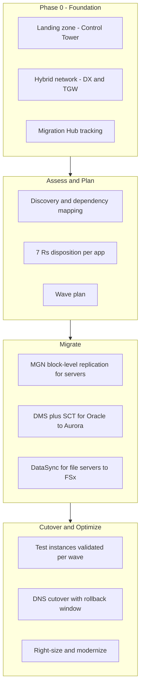

## The scenario

A retail company's data center lease expires in 14 months, forcing a hard deadline to move roughly 200 servers — a mix of web applications, a large Oracle database, Windows file servers, and a handful of appliances nobody fully understands. Leadership wants the e-commerce platform migrated with **near-zero downtime**, while internal tools can tolerate weekend cutover windows.

## Requirements breakdown

- **Hard deadline** — 14 months to empty the data center; the plan must be wave-based with buffer, not a big bang.
- **Near-zero downtime for e-commerce** — continuous replication and a fast cutover, not backup-restore migration.
- **Heterogeneous estate** — 200 servers need triage; not everything should be lifted and shifted, and some things should not move at all.
- **Database licensing pressure** — the Oracle bill is a board-level pain point; the migration is a chance to re-platform.
- **Governed target environment** — accounts, networking, and guardrails must exist before the first server lands.

## Recommended design

## Solution walkthrough

- **Landing zone first.** AWS Control Tower establishes the multi-account structure, SCPs, centralized logging, and network baseline before any workload moves. Migrating into a flat, ungoverned account is technical debt you pay for years. See the [Multi-Account architecture](../../architectures/multi-account).
- **Assess with the 7 Rs.** Every application gets a disposition: **Rehost**(lift and shift with MGN — the bulk of the 200 servers, because the deadline dominates), **Replatform**(Oracle to Aurora PostgreSQL, Windows file servers to FSx), **Repurchase**(the aging HR app moves to SaaS), **Refactor**(deferred — post-migration modernization, not on the critical path), **Relocate**(the VMware cluster, if any, via VMware Cloud on AWS), **Retire**(discovery typically finds 10–20% of servers nobody uses), and **Retain**(the mystery appliances stay until understood).
- **AWS Application Migration Service**(MGN) continuously replicates source servers at block level. Cutover launches the target instance from up-to-the-second data, so downtime is minutes — and non-disruptive *test* launches let each wave be validated days before its cutover window.
- **AWS DMS with Schema Conversion Tool** handles the Oracle-to-Aurora move: SCT converts schema and flags manual work, then DMS runs full load plus change data capture so the new database stays in sync until cutover. E-commerce cuts over by repointing connection strings during a low-traffic window measured in minutes.
- **Migration Hub** aggregates status across MGN, DMS, and discovery tooling so the program has one dashboard for 200 servers across a dozen waves.
- **Wave planning** groups servers by dependency, not by convenience: an app and its database move in the same wave. Wave 1 is deliberately low-risk (internal tools) to shake out the process; e-commerce goes mid-program once the runbook is proven; the trailing waves hold the stragglers and the buffer.

{}

### Discover and baseline

Run discovery agents for 2–4 weeks to capture utilization and real dependencies. Actual dependency maps always contradict the CMDB.

### Disposition and wave plan

Assign each app one of the 7 Rs, group by dependency into waves of 10–30 servers, and schedule waves with 20% schedule buffer.

### Replicate and test

Install MGN agents and start DMS tasks early — replication runs in the background for weeks. Launch test instances and run acceptance tests per wave.

### Cut over with a rollback plan

Cut over via DNS or connection-string change inside an agreed window. Keep sources replicating in reverse or on standby until the rollback window closes.

{}

## Options compared

| Approach | Downtime | Effort | Deadline risk | When it fits |
|---|---|---|---|---|
| Rehost with MGN | Minutes per server | Low per server | Low | Deadline-driven bulk moves; this scenario's default |
| Replatform (managed DB, FSx) | Minutes to hours | Medium | Medium | High-value targets like Oracle where licensing savings pay for the effort |
| Refactor to cloud-native | Varies | High | High | Post-migration; never on the critical path of a lease expiry |

The classic failure is refactoring everything and missing the deadline. The mature answer: rehost by default, replatform where the business case is obvious, refactor after the data center keys are handed back.

## Pitfalls seen in real projects

- **Trusting the CMDB instead of discovery data.** Undocumented dependencies break the first wave — an app that "talks to nothing" turns out to hard-code the IP of a server three waves away. Run agent-based discovery and map actual network flows.
- **Bandwidth math done too late.** Replicating 200 servers of initial data over a 1 Gbps link takes weeks. Start MGN replication early and stagger agent installs, or the cutover calendar slips.
- **Cutover windows without rollback criteria.** Teams debate at 3 a.m. whether to roll back. Define go/no-go checkpoints and a hard rollback time *before* the window starts.
- **Migrated servers left unoptimized.** Lift-and-shift lands over-provisioned on-premises sizing in the cloud at on-demand prices. Schedule a right-sizing pass 30–60 days post-cutover — see the [Cost Optimization playbook](cost-optimization).
- **DMS treated as fire-and-forget.** LOB columns, missing primary keys, and triggers all need special handling. Validate row counts and data content, not just task status.

## How to talk about this in an interview

"I worked on a deadline-driven migration of about 200 servers structured around the 7 Rs — roughly 70% rehosted with MGN for continuous replication and minutes-long cutovers, the Oracle estate replatformed to Aurora using SCT and DMS with CDC for a near-zero-downtime cutover, and around 15% retired outright after discovery showed no traffic. I planned dependency-based waves with a deliberately low-risk first wave to prove the runbook, tracked everything through Migration Hub, and insisted on a Control Tower landing zone before wave one — because migrating into an ungoverned account is how you inherit someone else's future audit finding."

## Related content

- Foundation: [Hybrid Networking playbook](hybrid-networking) — the connectivity that replication traffic rides on.
- Architecture reference: [Multi-Account](../../architectures/multi-account) for landing zone design; [Data & Analytics](../../architectures/data-analytics) for where the replatformed data estate goes next.
- Build it: start with [Lab 01 — Three-Tier Web](../../labs/lab-01-three-tier-web) to know the target state you are migrating into.
