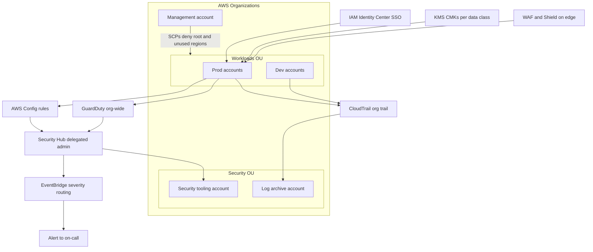

## The scenario

A fast-growing healthtech startup has landed its first enterprise customers, and the deals are contingent on a **SOC 2 Type II** report within nine months — with HIPAA obligations because the platform touches patient data, and an ISMS-P requirement looming for the Korean market entry. The engineering team is 25 people, security headcount is one, so everything must be automated and organization-wide by default.

## Requirements breakdown

- **Audit-ready evidence** — controls must produce continuous, queryable evidence, not screenshots gathered the week before the audit.
- **Organization-wide by default** — new accounts must be born compliant; per-account manual setup does not scale with one security engineer.
- **Least-privilege access** — human and workload access must be scoped, temporary where possible, and reviewable.
- **Encryption everywhere** — PHI demands encryption at rest and in transit with demonstrable key management.
- **Threat detection and response** — findings must land in one place with severity-based routing, not six consoles.

## Recommended design

## Solution walkthrough

- **IAM strategy.** Human access flows through **IAM Identity Center**(SSO) with permission sets mapped to job functions — no IAM users, no long-lived access keys. Workloads use IAM roles exclusively. Least privilege is enforced iteratively: start from managed policies, then tighten using IAM Access Analyzer's unused-access findings and policy generation from CloudTrail activity. Service control policies deny the dangerous outliers organization-wide: root user actions, disabling CloudTrail or GuardDuty, and use of unapproved Regions.
- **CloudTrail organization trail** writes every API call from every account — including accounts created next year — to a central, locked-down log archive account with S3 Object Lock. This single control satisfies a surprising fraction of SOC 2 evidence requests.
- **GuardDuty and Security Hub** are enabled via delegated administrator with auto-enrollment for new accounts. GuardDuty provides managed threat detection; Security Hub aggregates it with AWS Config compliance findings against the **AWS Foundational Security Best Practices** and CIS standards, giving the lone security engineer one queue. EventBridge routes critical findings to on-call and files the rest as tickets.
- **KMS encryption patterns.** Customer-managed keys are created per data classification (PHI, internal, public), with key policies separating key administrators from key users. S3, EBS, RDS, and DynamoDB all encrypt with the appropriate CMK; SCP and Config rules make unencrypted resources non-compliant by default. Annual key rotation is enabled; grants and key policies become the auditable story of who can decrypt what.
- **WAF and Shield.** AWS WAF on CloudFront and the ALB applies managed rule groups (core rule set, known bad inputs, IP reputation) plus rate limiting. Shield Standard is automatic; Shield Advanced is deferred until the DDoS risk profile justifies its cost.
- **Compliance frameworks, mapped once.** SOC 2, HIPAA, and ISMS-P overlap heavily at the technical layer — access control, encryption, logging, monitoring, change management. Build controls once, map them to each framework's language, and use Security Hub standards plus AWS Audit Manager to generate evidence continuously. HIPAA additionally requires a signed **Business Associate Addendum** with AWS and restricting PHI to HIPAA-eligible services; ISMS-P adds Korean regulatory specifics best handled with a local consultant, but the technical control base is the same.


Compliance is not security. A workload can pass every Security Hub check and still be breached through a leaked credential or an over-privileged role. Treat frameworks as the floor, and threat modeling as the actual job.


## Options compared

| Approach | Coverage | Ongoing effort | Audit evidence | When it fits |
|---|---|---|---|---|
| Per-account manual setup | Inconsistent | High, grows per account | Manual collection | Never past 2–3 accounts |
| Org-wide native services (this design) | Every account, auto-enrolled | Low after setup | Continuous via Security Hub and Audit Manager | Small teams, standard frameworks |
| Third-party CSPM/CNAPP platform | Multi-cloud, richer context | Medium plus license cost | Strong | Multi-cloud estates, larger security teams |

With one security engineer and an AWS-only footprint, org-wide native services deliver the coverage-to-effort ratio the scenario needs; a CSPM purchase is a later optimization, not a prerequisite.

## Pitfalls seen in real projects

- **Alert fatigue kills the program.** Enabling every Security Hub standard on day one produces thousands of findings, the team tunes out, and real signals drown. Start with one standard, triage to zero criticals, then expand.
- **SCPs tested in prod.** An overly broad deny SCP locks a build pipeline out of KMS at 2 p.m. on release day. Stage SCPs against a sandbox OU first and always scope with conditions.
- **Break-glass access is an afterthought.** When SSO goes down, nobody can get in — or worse, everyone shares a root password in a wiki. Define, vault, and *test* the break-glass procedure quarterly.
- **KMS key deletion and cross-account surprises.** A deleted CMK makes data unrecoverable forever, and cross-account snapshot sharing silently fails with default keys. Enforce deletion windows, alarms on ScheduleKeyDeletion, and CMKs for anything shared.
- **Evidence gathered annually instead of continuously.** The audit becomes a three-week fire drill of screenshots. Wire Audit Manager and Security Hub exports from month one so the audit is a report, not a project.

## How to talk about this in an interview

"I built the security baseline that took a healthtech platform through SOC 2 Type II with HIPAA obligations, designed around a one-person security team. The core was making every control organizational: a CloudTrail org trail into a locked log-archive account, GuardDuty and Security Hub with delegated admin and auto-enrollment, SCP guardrails, SSO with no long-lived keys, and per-data-classification KMS keys. The insight I'd emphasize is that SOC 2, HIPAA, and ISMS-P share most of their technical controls — so we built controls once and mapped evidence to each framework, which turned the audit from a fire drill into a reporting exercise."

## Related content

- Architecture reference: [Multi-Account](../../architectures/multi-account) — the account structure these guardrails attach to.
- Related playbook: the [Migration playbook](migration) covers standing up this baseline as landing-zone phase zero.
- Build it: see the [labs index](../../labs/) — every lab includes the IAM and encryption steps that produce this evidence trail.
